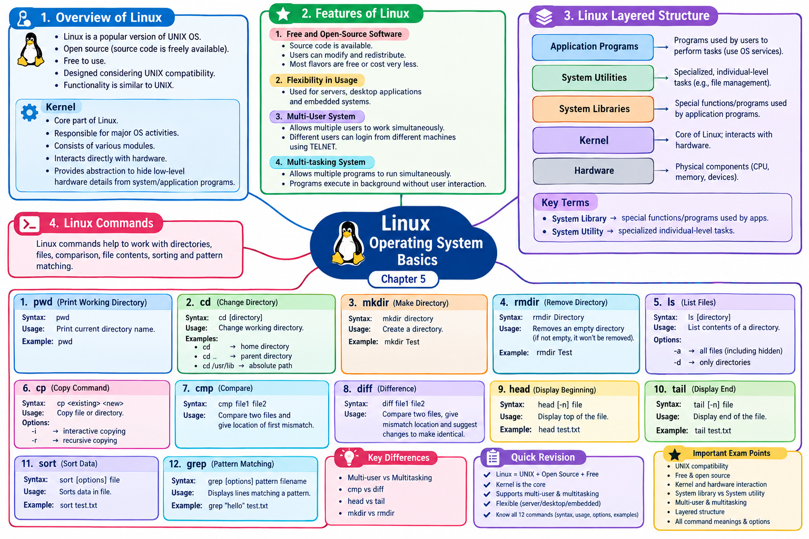

# LJ-os-sem3-chapter5-explained


# 📘 Operating Systems — Chapter 5

# Linux Operating System Basics

The uploaded PPT contains two main areas: **Overview of Linux** and **Linux Commands**. The chapter also covers Linux features and its layered structure.

---

# STEP 1 — DEEP EXPLANATION

## 1. Overview of Linux

### What is Linux?

**Linux is a popular version of the UNIX operating system.**

According to the PPT:

- Linux is **open source**.
    
- Its **source code is freely available**.
    
- It is **free to use**.
    
- Linux was designed with **UNIX compatibility** in mind.
    
- Its functionality is quite similar to UNIX.
    

### What does Open Source mean?

An **open-source operating system** provides its source code to users.

This means users can:

- Study the source code.
    
- Modify it according to their requirements.
    
- Create modified versions.
    
- Redistribute modified versions.
    

The PPT specifically describes Linux as open source because its source code is available.

### Simple example

Think of software like a recipe.

**Closed-source software:**

```text
Software
   │
   └── Recipe is hidden
       ↓
   User can use it
   but cannot freely modify the original recipe
```

**Open-source software:**

```text
Software
   │
   └── Source Code Available
            │
       ┌────┼────┐
       ↓    ↓    ↓
     Study Modify Redistribute
```

---

# 2. Linux Kernel

The **Kernel is the core part of Linux**.

It is responsible for the major activities of the operating system.

The PPT states that the kernel:

- Is the core of Linux.
    
- Performs major operating-system activities.
    
- Consists of various modules.
    
- Interacts directly with the underlying hardware.
    
- Provides abstraction that hides low-level hardware details from system/application programs.
    

### Understanding the Kernel

Imagine an application wants to use the CPU.

The application doesn't directly need to control the physical CPU hardware.

Instead:

```text
Application Program
        │
        ↓
      Kernel
        │
        ↓
     Hardware
       CPU
```

The kernel acts as an important intermediary between software and hardware.

### Hardware abstraction

The kernel hides complicated low-level hardware details.

```text
Application / System Programs
             │
             ↓
          KERNEL
   ┌─────────┼─────────┐
   ↓         ↓         ↓
  CPU       Memory    Devices
             │
             ↓
          Hardware
```

### ⭐ Exam Point

> **Kernel is the core part of Linux and is responsible for major operating-system activities while interacting directly with hardware.**

---

# 3. Features of Linux Operating System

The PPT identifies several important features of Linux.

---

## Feature 1 — Free and Open-Source Software

Linux is described as both **free** and **open source**.

### Open source

The source code is available.

### Free

Users have freedom to make changes to the source code according to their requirements.

Modified versions can also be redistributed.

The PPT also states that most Linux distributions/flavors are either completely free or cost very little compared with other operating systems.

### Important distinction

|Term|Meaning|
|---|---|
|Open Source|Source code is available|
|Free|Users have freedom to use/modify according to the stated open-source model|

### ⭐ Exam Point

Linux's open-source nature allows its source code to be modified and redistributed.

---

# 4. Flexibility in Usage

Linux can be used in different types of computing environments.

The PPT specifically mentions:

```text
Linux
 │
 ├── High-performance server applications
 │
 ├── Desktop applications
 │
 └── Embedded systems
```

This demonstrates the **flexibility** of Linux.

### Example

Linux can be used:

- On a server handling applications.
    
- On a desktop computer.
    
- In an embedded computing system.
    

### ⭐ Exam Point

> Linux provides flexibility because it can be used for server applications, desktop applications, and embedded systems.

---

# 5. Multi-User System

Linux is a **multi-user operating system**.

### Definition

A multi-user operating system allows **multiple users to work simultaneously on the same system**.

Conceptually:

```text
User 1 ─────┐
User 2 ─────┤
User 3 ─────┼──→ Linux System
User 4 ─────┤
User 5 ─────┘
```

Different users can log in from different machines to the same machine.

The PPT mentions **TELNET** in this context.

### Real-world idea

Suppose a Linux server is being used by several users:

```text
Computer A ──→
Computer B ──→  Linux Server
Computer C ──→
Computer D ──→
```

Multiple users can work with the same Linux system.

### ⭐ Exam Point

**Multi-user system:** An operating system that allows multiple users to work simultaneously on the same system.

---

# 6. Multitasking System

Linux is also a **multitasking operating system**.

### Definition

A multitasking operating system allows **multiple programs to run simultaneously**.

The PPT also states that programs can execute in the background without requiring user interaction.

Conceptually:

```text
             Linux
               │
       ┌───────┼────────┐
       ↓       ↓        ↓
   Program A Program B Program C
       │       │        │
       └───────┼────────┘
               ↓
       Multiple tasks
```

### Example

A user may have:

```text
Music Player       → Running
Text Editor        → Running
File Operation     → Running
Background Task    → Running
```

The operating system manages these tasks.

### Multi-user vs Multitasking

|Multi-user|Multitasking|
|---|---|
|Multiple users can use the system|Multiple programs/tasks can execute|
|Focus is on users|Focus is on programs/tasks|
|Example: several users accessing a Linux system|Example: editor + music + background process|

### ⭐ Exam Point

Do not confuse:

**Multi-user ≠ Multitasking**

They describe two different capabilities.

---

# 7. Linux Layered Structure

The PPT includes a section called **Linux Layered Structure**. It reiterates Linux's UNIX compatibility and open-source nature and identifies components including **System Library** and **System Utility**.

The PPT states:

### System Library

**System libraries are special functions or programs used by application programs.**

### System Utility

**System utility programs are responsible for specialized, individual-level tasks.**

### Conceptual layered view

Based on the components identified in the PPT:

```text
┌───────────────────────────────────┐
│       Application Programs        │
├───────────────────────────────────┤
│          System Utilities         │
├───────────────────────────────────┤
│          System Libraries         │
├───────────────────────────────────┤
│              Kernel               │
├───────────────────────────────────┤
│             Hardware              │
└───────────────────────────────────┘
```

### Understanding the layers

#### Application Programs

These are programs used by users to perform tasks.

They use operating-system functionality rather than directly managing hardware.

#### System Utilities

These perform specialized tasks.

For example, Linux provides command-line utilities for working with files and directories.

#### System Libraries

These provide special functions/program interfaces that application programs can use.

#### Kernel

The kernel is the core of Linux and interacts directly with hardware.

#### Hardware

The physical components of the computer are at the bottom.

### ⭐ Exam Point

Remember the two terms explicitly given in the PPT:

> **System Library → special functions/programs used by application programs**

> **System Utility → specialized individual-level tasks**

---

# 8. Linux Commands

The second major part of the chapter is **Linux Commands**. The PPT introduces commands for directories, files, comparison, displaying file contents, sorting, and pattern matching.

Let's cover every command given in the PPT.

---

# 9. `pwd` — Print Working Directory

### Meaning

`pwd` stands for:

> **Print Working Directory**

### Syntax

```bash
pwd
```

### Usage

It prints/displays the name of the current working directory.

### Example

```bash
$ pwd
/home/student
```

This tells us that the current working directory is `/home/student`.

### ⭐ Remember

```text
pwd
 ↓
Print Working Directory
 ↓
Shows current directory
```

---

# 10. `cd` — Change Directory

### Meaning

`cd` stands for:

> **Change Directory**

### Syntax

```bash
cd [directory]
```

### Usage

Used to change the current working directory.

---

## Example 1 — `cd`

```bash
cd
```

Changes the working directory to the **home directory**, according to the PPT.

---

## Example 2 — `cd ..`

```bash
cd ..
```

Changes the working directory to the **parent directory**.

Diagram:

```text
/home/student/projects
             │
          cd ..
             ↓
/home/student
```

---

## Example 3 — Absolute path

```bash
cd /usr/lib
```

Changes the working directory to the absolute path `/usr/lib`.

### ⭐ Exam Point

Know the difference:

```text
cd       → Home directory
cd ..    → Parent directory
cd /usr/lib → Specific absolute path
```

---

# 11. `mkdir` — Make Directory

### Meaning

`mkdir` means:

> **Make Directory**

### Syntax

```bash
mkdir directory
```

It is used to create a directory.

### Example

```bash
mkdir Test
```

Conceptually:

```text
Before:
Current Directory
 ├── file1
 └── file2

mkdir Test

After:
Current Directory
 ├── file1
 ├── file2
 └── Test/
```

---

# 12. `rmdir` — Remove Directory

### Meaning

`rmdir` means:

> **Remove Directory**

### Syntax

```bash
rmdir Directory
```

### Usage

It removes an **empty directory**.

If the directory is not empty, it will not be removed.

### Example

```bash
rmdir Test
```

This removes the directory named `Test` **if it is empty**.

### Important

```text
Test/
  │
  ├── empty
  │       ↓
  │    rmdir Test
  │       ↓
  │    Removed
```

But:

```text
Test/
  │
  ├── file.txt
  │
  ↓
rmdir Test
  ↓
Not removed
```

### ⭐ Exam Point

> `rmdir` removes an empty directory; it does not remove a non-empty directory according to the PPT.

---

# 13. `ls` — List Files

### Meaning

`ls` is used to **list files/content of a directory**.

### Syntax

```bash
ls [directory]
```

### Usage

Lists the contents of a directory.

### Options given in PPT

|Option|Meaning|
|---|---|
|`-a`|List all files, including hidden ones|
|`-d`|List only directories|

The PPT lists `a` and `d` as options.

### Example

```bash
ls
```

Lists directory contents.

```bash
ls -a
```

Lists all files, including hidden files.

```bash
ls -d
```

Lists only directories.

---

# 14. `cp` — Copy Command

### Meaning

`cp` is the **copy command**.

It is used to copy a:

- File
    
- Directory
    

The PPT gives the following syntax and options.

### Syntax

```bash
cp <existing file name> <new file name>
```

### Example

```bash
cp old.txt new.txt
```

Conceptually:

```text
old.txt
   │
   │ cp
   ↓
new.txt

Original remains
       +
Copy is created
```

### Options

|Option|Meaning|
|---|---|
|`-i`|Interactive copying|
|`-r`|Recursive copying|

### ⭐ Exam Point

Remember:

```text
cp -i → Interactive
cp -r → Recursive
```

---

# 15. `cmp` — Compare

### Meaning

`cmp` is used to **compare two files**.

### Syntax

```bash
cmp file1 file2
```

### Usage

It compares two files and gives the **location of the first mismatch**.

### Concept

```text
file1 ─────┐
           ├──→ cmp ──→ First mismatch
file2 ─────┘
```

### Example

```bash
cmp file1.txt file2.txt
```

It checks the files and identifies the first mismatch.

---

# 16. `diff` — Difference

### Meaning

`diff` compares two files.

### Syntax

```bash
diff file1 file2
```

### Usage

Unlike the PPT's description of `cmp`, `diff`:

- Compares two files.
    
- Gives the location of mismatches.
    
- Suggests changes required to make the two files identical.
    

### Conceptual difference

```text
             Compare
                │
        ┌───────┴───────┐
        ↓               ↓
       cmp             diff
        │               │
 First mismatch     Mismatch +
                    suggested
                    changes
```

### ⭐ Important Difference

|`cmp`|`diff`|
|---|---|
|Compares two files|Compares two files|
|Gives location of first mismatch|Gives mismatch information and suggests changes|
|Focuses on first mismatch|Provides more information about differences|

---

# 17. `head` — Display Beginning of File

### Meaning

`head` displays the **top/beginning portion of a file**.

### Syntax

```bash
head [-n] file
```

### Usage

Displays the top of the file.

### Example

```bash
head test.txt
```

The PPT specifically gives this example.

Conceptually:

```text
test.txt

Line 1  ←
Line 2  ←
Line 3  ←
Line 4
Line 5
Line 6
...
```

`head` displays the beginning portion.

---

# 18. `tail` — Display End of File

### Meaning

`tail` displays the **end portion of a file**.

### Syntax

```bash
tail [-n] file
```

### Usage

Displays the end of the file.

### Example

```bash
tail test.txt
```

### Easy way to remember

```text
head → Beginning
  ↓
TOP of file


tail → End
  ↓
BOTTOM of file
```

### ⭐ Important Difference

|`head`|`tail`|
|---|---|
|Displays top of file|Displays end of file|
|Beginning|End|

---

# 19. `sort` — Sort Data

### Meaning

`sort` is used to **sort data in a file**.

### Syntax

```bash
sort [options] file
```

### Usage

Sorts data in the file.

### Example

```bash
sort test.txt
```

The PPT provides this exact example.

Conceptually:

```text
Unsorted data
     │
     ↓
   sort
     │
     ↓
Sorted data
```

---

# 20. `grep` — Pattern Matching

### Meaning

`grep` is used to find/display lines that match a specified pattern.

### Syntax

```bash
grep [options] pattern filename
```

### Usage

It displays lines from files that match the given pattern.

### Example from PPT

```bash
grep "hello" test.txt
```

This performs simple pattern matching for `"hello"`.

Conceptually:

```text
test.txt
   │
   ├── Hello world
   ├── Linux OS
   ├── hello student
   ├── Operating System
   └── hello Linux
          │
          ↓
        grep
          │
          ↓
 Lines matching pattern
```

### ⭐ Exam Point

> `grep` displays lines from files that match a specified pattern.

---

# 🧠 Linux Commands — Quick Revision Table

|Command|Full Meaning|Main Use|
|---|---|---|
|`pwd`|Print Working Directory|Display current directory|
|`cd`|Change Directory|Change working directory|
|`mkdir`|Make Directory|Create directory|
|`rmdir`|Remove Directory|Remove empty directory|
|`ls`|List files|List directory contents|
|`cp`|Copy|Copy files/directories|
|`cmp`|Compare|Compare files and find first mismatch|
|`diff`|Difference|Compare files and suggest changes|
|`head`|—|Display top of file|
|`tail`|—|Display end of file|
|`sort`|—|Sort data in a file|
|`grep`|—|Display lines matching a pattern|

These commands and their uses are taken from the command section of the uploaded PPT.

---

# 🔥 Important Command Relationships

## Directory Commands

```text
Directory Management
       │
       ├── pwd
       │     └── Show current directory
       │
       ├── cd
       │     └── Change directory
       │
       ├── mkdir
       │     └── Create directory
       │
       └── rmdir
             └── Remove empty directory
```

## File Commands

```text
File Operations
       │
       ├── ls
       │     └── List contents
       │
       ├── cp
       │     └── Copy
       │
       ├── cmp
       │     └── Compare
       │
       └── diff
             └── Compare + suggest changes
```

## File Content Commands

```text
File Content / Processing
       │
       ├── head
       │     └── Beginning
       │
       ├── tail
       │     └── End
       │
       ├── sort
       │     └── Sort data
       │
       └── grep
             └── Pattern matching
```

---

# 📌 CHAPTER SUMMARY

**Linux Operating System Basics** covers:

```text
Linux
│
├── Overview
│   ├── UNIX compatibility
│   ├── Open source
│   ├── Free to use
│   └── Kernel
│
├── Features
│   ├── Free & Open Source
│   ├── Flexible Usage
│   ├── Multi-user
│   └── Multitasking
│
├── Layered Structure
│   ├── Kernel
│   ├── System Libraries
│   ├── System Utilities
│   └── Application Programs
│
└── Linux Commands
    ├── pwd
    ├── cd
    ├── mkdir
    ├── rmdir
    ├── ls
    ├── cp
    ├── cmp
    ├── diff
    ├── head
    ├── tail
    ├── sort
    └── grep
```

---

# 📖 IMPORTANT DEFINITIONS

### 1. Linux

Linux is a popular version of the UNIX operating system that is open source and free to use.

### 2. Kernel

The kernel is the core part of Linux responsible for major operating-system activities and direct interaction with hardware.

### 3. Open Source

Open source means that the source code is available, allowing modification and redistribution according to the applicable licensing terms.

### 4. Multi-user System

A system that allows multiple users to work simultaneously on the same system.

### 5. Multitasking System

A system that allows multiple programs to run simultaneously.

### 6. System Library

Special functions or programs used by application programs.

### 7. System Utility

Programs responsible for specialized, individual-level tasks.

### 8. `pwd`

Command used to print the working directory.

### 9. `mkdir`

Command used to make/create a directory.

### 10. `rmdir`

Command used to remove an empty directory.

### 11. `grep`

Command that displays lines matching a specified pattern.

---

# ⚖️ IMPORTANT DIFFERENCES

## Multi-user vs Multitasking

|Multi-user|Multitasking|
|---|---|
|Multiple users|Multiple programs|
|Users can work simultaneously|Programs can execute simultaneously|
|Concerned with users|Concerned with tasks/programs|

## `cmp` vs `diff`

|`cmp`|`diff`|
|---|---|
|Compares two files|Compares two files|
|Gives location of first mismatch|Gives mismatch information and suggests changes|
|More focused on first mismatch|Helps identify changes needed for identical files|

## `head` vs `tail`

|`head`|`tail`|
|---|---|
|Displays top of file|Displays end of file|
|Beginning|End|

## `mkdir` vs `rmdir`

|`mkdir`|`rmdir`|
|---|---|
|Creates directory|Removes directory|
|`mkdir directory`|`rmdir directory`|
|Makes a directory|Removes an empty directory|

---

# 🎯 IMPORTANT EXAM POINTS

1. **Linux is a popular version of UNIX OS.**
    
2. Linux is **open source**.
    
3. Linux source code is freely available.
    
4. Linux was designed considering **UNIX compatibility**.
    
5. **Kernel is the core part of Linux.**
    
6. Kernel interacts directly with hardware.
    
7. Kernel provides abstraction to hide low-level hardware details.
    
8. Linux supports **multi-user** operation.
    
9. Linux supports **multitasking**.
    
10. Linux can be used for servers, desktops, and embedded systems.
    
11. **System Libraries** provide special functions/programs used by applications.
    
12. **System Utilities** perform specialized individual-level tasks.
    
13. `pwd` → Print Working Directory.
    
14. `cd` → Change Directory.
    
15. `mkdir` → Make Directory.
    
16. `rmdir` → Remove an empty directory.
    
17. `ls` → List directory contents.
    
18. `cp` → Copy files/directories.
    
19. `cmp` → Compare files and identify the first mismatch.
    
20. `diff` → Compare files and suggest changes.
    
21. `head` → Display the top of a file.
    
22. `tail` → Display the end of a file.
    
23. `sort` → Sort data in a file.
    
24. `grep` → Display lines matching a pattern.
    
25. `cp -i` → Interactive copying.
    
26. `cp -r` → Recursive copying.
    
27. `ls -a` → List all files, including hidden ones.
    
28. `ls -d` → List only directories.
    

The command definitions, syntax, options, and examples above are grounded in the uploaded Chapter 5 PPT.

---

## ✅ STEP 1 COMPLETE

The PPT's content has been covered in order:

**Overview → Kernel → Features → Flexibility → Multi-user → Multitasking → Layered Structure → System Libraries → System Utilities → Linux Commands → `pwd` → `cd` → `mkdir` → `rmdir` → `ls` → `cp` → `cmp` → `diff` → `head` → `tail` → `sort` → `grep`.**

### Next in the required workflow:

**STEP 2 — Complete Mind Map**

Just say **“next”** and I’ll continue from **Step 2**, without restarting or repeating Step 1.

<p align="center">
  
</p>
# 🧠 STEP 2 — COMPLETE MIND MAP

```text
LINUX OPERATING SYSTEM BASICS — CHAPTER 5
│
├── 1. OVERVIEW OF LINUX
│   │
│   ├── Linux
│   │   ├── Popular version of UNIX OS
│   │   ├── Open source
│   │   ├── Free to use
│   │   ├── UNIX compatible
│   │   └── Similar functionality to UNIX
│   │
│   └── Kernel
│       ├── Core part of Linux
│       ├── Responsible for major OS activities
│       ├── Consists of various modules
│       ├── Interacts directly with hardware
│       └── Provides hardware abstraction
│
├── 2. FEATURES OF LINUX
│   │
│   ├── Free and Open-Source Software
│   │   ├── Source code available
│   │   ├── Can be modified
│   │   ├── Modified versions can be redistributed
│   │   └── Most flavors are free/low cost
│   │
│   ├── Flexibility in Usage
│   │   ├── High-performance servers
│   │   ├── Desktop applications
│   │   └── Embedded systems
│   │
│   ├── Multi-User System
│   │   ├── Multiple users simultaneously
│   │   └── Different machines can connect
│   │
│   └── Multitasking System
│       ├── Multiple programs simultaneously
│       └── Programs can execute in background
│
├── 3. LINUX LAYERED STRUCTURE
│   │
│   ├── Application Programs
│   │
│   ├── System Utilities
│   │   └── Specialized individual-level tasks
│   │
│   ├── System Libraries
│   │   └── Special functions/programs for applications
│   │
│   └── Kernel
│       └── Core + hardware interaction
│
└── 4. LINUX COMMANDS
    │
    ├── pwd — Print Working Directory
    │   ├── Syntax: pwd
    │   └── Prints working directory
    │
    ├── cd — Change Directory
    │   ├── Syntax: cd [directory]
    │   ├── cd → home directory
    │   ├── cd .. → parent directory
    │   └── cd /usr/lib → absolute path
    │
    ├── mkdir — Make Directory
    │   └── Syntax: mkdir directory
    │
    ├── rmdir — Remove Directory
    │   ├── Syntax: rmdir Directory
    │   └── Removes empty directory
    │
    ├── ls — List Files
    │   ├── Syntax: ls [directory]
    │   ├── -a → all files including hidden
    │   └── -d → only directories
    │
    ├── cp — Copy
    │   ├── Syntax: cp <existing> <new>
    │   ├── -i → interactive
    │   └── -r → recursive
    │
    ├── cmp — Compare
    │   ├── Syntax: cmp file1 file2
    │   └── Gives location of first mismatch
    │
    ├── diff — Difference
    │   ├── Syntax: diff file1 file2
    │   └── Gives mismatch + suggested changes
    │
    ├── head
    │   ├── Syntax: head [-n] file
    │   └── Displays top of file
    │
    ├── tail
    │   ├── Syntax: tail [-n] file
    │   └── Displays end of file
    │
    ├── sort
    │   ├── Syntax: sort [options] file
    │   └── Sorts data in file
    │
    └── grep
        ├── Syntax: grep [options] pattern filename
        └── Displays lines matching pattern
```

This mind map follows the topics and command details present in the uploaded Chapter 5 PPT.

# 🖼️ STEP 3 — MIND MAP IMAGE

I created the **complete visual revision mind map** covering the chapter's overview, kernel, Linux features, layered structure, and all 12 commands.

The image includes the command syntax/usage and the key comparisons for quick exam revision.

# ✅ STEP 2 + STEP 3 COMPLETE

### Coverage included

- ✅ Overview of Linux
    
- ✅ Kernel
    
- ✅ Free and Open-Source Software
    
- ✅ Flexibility
    
- ✅ Multi-user system
    
- ✅ Multitasking system
    
- ✅ Linux layered structure
    
- ✅ System Library
    
- ✅ System Utility
    
- ✅ `pwd`
    
- ✅ `cd`
    
- ✅ `mkdir`
    
- ✅ `rmdir`
    
- ✅ `ls`
    
- ✅ `cp`
    
- ✅ `cmp`
    
- ✅ `diff`
    
- ✅ `head`
    
- ✅ `tail`
    
- ✅ `sort`
    
- ✅ `grep`
    
- ✅ Command options
    
- ✅ Command examples
    
- ✅ Important differences
    

## ➡️ NEXT: STEP 4 — MCQs FIRST

When you say **“next”**, I will start the **complete MCQ question bank with answers immediately after every question**, and I will keep track of the count so we don't restart or repeat questions.

# 📝 STEP 4 — COMPLETE MCQ QUESTION BANK

## Operating Systems — Chapter 5

### Linux Operating System Basics

The MCQs below cover the complete PPT: Linux overview, kernel, features, layered structure, system libraries, system utilities, and all Linux commands/options/examples.

---

## 🟢 A. OVERVIEW OF LINUX

### Q1. Linux is a popular version of which operating system?

A) Windows  
B) UNIX  
C) DOS  
D) macOS

**Answer: B) UNIX**

---

### Q2. Linux is described in the PPT as:

A) Closed source  
B) Open source  
C) Proprietary only  
D) Hardware software

**Answer: B) Open source**

---

### Q3. What does open source mean in the context of Linux?

A) Source code is hidden  
B) Source code is freely available  
C) Only hardware is available  
D) Linux cannot be modified

**Answer: B) Source code is freely available**

---

### Q4. Linux was designed considering compatibility with:

A) DOS  
B) Windows  
C) UNIX  
D) Android

**Answer: C) UNIX**

---

### Q5. Linux has functionality that is quite similar to:

A) UNIX  
B) BIOS  
C) HTML  
D) SQL

**Answer: A) UNIX**

---

### Q6. Which statement about Linux is correct according to the PPT?

A) It is only available for servers  
B) It is free to use  
C) It cannot be modified  
D) Its source code is unavailable

**Answer: B) It is free to use**

---

### Q7. Which component is the core part of Linux?

A) System Utility  
B) System Library  
C) Kernel  
D) Application Program

**Answer: C) Kernel**

---

### Q8. The Linux kernel is responsible for:

A) Only displaying text  
B) Major operating-system activities  
C) Only creating directories  
D) Only sorting files

**Answer: B) Major operating-system activities**

---

### Q9. The Linux kernel interacts directly with:

A) Users only  
B) Applications only  
C) Underlying hardware  
D) Text files only

**Answer: C) Underlying hardware**

---

### Q10. The kernel consists of:

A) Various modules  
B) Only one program  
C) Only application files  
D) Only directories

**Answer: A) Various modules**

---

### Q11. What does the kernel provide to system or application programs?

A) Hardware abstraction  
B) Internet access only  
C) File compression only  
D) Text formatting

**Answer: A) Hardware abstraction**

---

### Q12. Hardware abstraction helps to:

A) Expose all low-level hardware details  
B) Hide low-level hardware details  
C) Delete hardware  
D) Replace the kernel

**Answer: B) Hide low-level hardware details**

---

## 🟢 B. FEATURES OF LINUX

### Q13. Which of the following is a feature of Linux mentioned in the PPT?

A) Free and open-source software  
B) Single-user only  
C) Single-tasking only  
D) Hardware-only operation

**Answer: A) Free and open-source software**

---

### Q14. Linux source code can be:

A) Only viewed by the manufacturer  
B) Modified according to requirements  
C) Never modified  
D) Used only for hardware

**Answer: B) Modified according to requirements**

---

### Q15. Modified versions of Linux can be:

A) Redistributed  
B) Destroyed only  
C) Used only privately  
D) Converted into hardware

**Answer: A) Redistributed**

---

### Q16. According to the PPT, most Linux flavors are:

A) Very expensive  
B) Either totally free or very low cost  
C) Available only through hardware vendors  
D) Not available to users

**Answer: B) Either totally free or very low cost**

---

### Q17. Linux can be used for:

A) High-performance server applications  
B) Desktop applications  
C) Embedded systems  
D) All of the above

**Answer: D) All of the above**

---

### Q18. The ability of Linux to be used in servers, desktops, and embedded systems demonstrates its:

A) Complexity  
B) Flexibility  
C) Limitation  
D) Hardware dependency

**Answer: B) Flexibility**

---

### Q19. Linux is a:

A) Single-user operating system  
B) Multi-user operating system  
C) Single-program operating system  
D) Hardware operating system

**Answer: B) Multi-user operating system**

---

### Q20. A multi-user operating system allows:

A) Only one user to work  
B) Multiple users to work simultaneously  
C) Only administrators to work  
D) No users to work simultaneously

**Answer: B) Multiple users to work simultaneously**

---

### Q21. According to the PPT, different users can log in from different machines into the same machine using programs such as:

A) TELNET  
B) `grep`  
C) `sort`  
D) `mkdir`

**Answer: A) TELNET**

---

### Q22. Linux is also a:

A) Multitasking operating system  
B) Single-tasking operating system  
C) Single-user operating system  
D) Non-operating system

**Answer: A) Multitasking operating system**

---

### Q23. Multitasking means:

A) Multiple users share one password  
B) Multiple programs can run simultaneously  
C) Multiple computers become one computer  
D) Multiple kernels run only

**Answer: B) Multiple programs can run simultaneously**

---

### Q24. According to the PPT, programs can execute in the background:

A) Without requiring user interaction  
B) Only after shutdown  
C) Only when no user is logged in  
D) Only outside Linux

**Answer: A) Without requiring user interaction**

---

### Q25. Which pair correctly represents two Linux features?

A) Multi-user and multitasking  
B) Single-user and single-tasking  
C) Closed-source and single-tasking  
D) Hardware-only and single-user

**Answer: A) Multi-user and multitasking**

---

## 🟢 C. LINUX LAYERED STRUCTURE

### Q26. Which component is the core of Linux?

A) System Utility  
B) Kernel  
C) Application Program  
D) Command Shell

**Answer: B) Kernel**

---

### Q27. System libraries are:

A) Special functions or programs used by application programs  
B) Physical hardware components  
C) User accounts  
D) Only directories

**Answer: A) Special functions or programs used by application programs**

---

### Q28. System utility programs are responsible for:

A) Specialized individual-level tasks  
B) Manufacturing hardware  
C) Creating kernels  
D) Replacing applications

**Answer: A) Specialized individual-level tasks**

---

### Q29. Which of the following is explicitly identified in the PPT's Linux layered structure?

A) System Library  
B) System Utility  
C) Kernel  
D) All of the above

**Answer: D) All of the above**

---

### Q30. Which component directly interacts with underlying hardware?

A) Application program  
B) System utility  
C) Kernel  
D) User

**Answer: C) Kernel**

---

### Q31. Which component provides special functions/programs used by application programs?

A) System Library  
B) Hardware  
C) Kernel module only  
D) User account

**Answer: A) System Library**

---

### Q32. Which component performs specialized individual-level tasks?

A) System Utility  
B) Kernel  
C) Hardware  
D) Application data

**Answer: A) System Utility**

---

## 🟢 D. `pwd` AND `cd`

### Q33. What does `pwd` stand for?

A) Print Working Directory  
B) Program Working Data  
C) Print Windows Directory  
D) Process Working Directory

**Answer: A) Print Working Directory**

---

### Q34. What is the syntax of `pwd`?

A) `pwd directory`  
B) `pwd`  
C) `print pwd`  
D) `pwd -directory`

**Answer: B) `pwd`**

---

### Q35. What is the main purpose of `pwd`?

A) Create a directory  
B) Remove a directory  
C) Print the working directory name  
D) Copy a file

**Answer: C) Print the working directory name**

---

### Q36. Which command is used to change the working directory?

A) `pwd`  
B) `cd`  
C) `ls`  
D) `cp`

**Answer: B) `cd`**

---

### Q37. What does `cd` stand for?

A) Copy Directory  
B) Change Directory  
C) Create Directory  
D) Compare Directory

**Answer: B) Change Directory**

---

### Q38. What is the syntax given for `cd`?

A) `cd [directory]`  
B) `cd <file>`  
C) `change directory`  
D) `directory cd`

**Answer: A) `cd [directory]`**

---

### Q39. According to the PPT, entering `cd` changes the working directory to:

A) Root directory  
B) Home directory  
C) Parent directory  
D) `/usr/lib`

**Answer: B) Home directory**

---

### Q40. What does `cd ..` do?

A) Goes to the home directory  
B) Goes to the parent directory  
C) Creates a directory  
D) Removes a directory

**Answer: B) Goes to the parent directory**

---

### Q41. Which command changes the working directory to `/usr/lib`?

A) `cd usr/lib`  
B) `cd /usr/lib`  
C) `pwd /usr/lib`  
D) `ls /usr/lib`

**Answer: B) `cd /usr/lib`**

---

### Q42. `/usr/lib` in the PPT is an example of:

A) A file name  
B) An absolute path  
C) A command option  
D) A pattern

**Answer: B) An absolute path**

---

## 🟢 E. `mkdir` AND `rmdir`

### Q43. What does `mkdir` mean?

A) Make Directory  
B) Move Directory  
C) Modify Directory  
D) Main Directory

**Answer: A) Make Directory**

---

### Q44. Which command creates a directory?

A) `rmdir`  
B) `mkdir`  
C) `pwd`  
D) `head`

**Answer: B) `mkdir`**

---

### Q45. What is the syntax of `mkdir`?

A) `mkdir directory`  
B) `mkdir [file]`  
C) `make directory`  
D) `directory mkdir`

**Answer: A) `mkdir directory`**

---

### Q46. What does the following command do?

```bash
mkdir Test
```

A) Removes Test  
B) Creates Test directory  
C) Lists Test  
D) Compares Test

**Answer: B) Creates Test directory**

---

### Q47. What does `rmdir` mean?

A) Read Directory  
B) Remove Directory  
C) Rename Directory  
D) Run Directory

**Answer: B) Remove Directory**

---

### Q48. Which type of directory can `rmdir` remove according to the PPT?

A) Any directory  
B) Only non-empty directories  
C) Empty directory  
D) Only root directory

**Answer: C) Empty directory**

---

### Q49. What happens if the directory is not empty when `rmdir` is used?

A) It is removed automatically  
B) It will not be removed  
C) All files are copied  
D) Linux shuts down

**Answer: B) It will not be removed**

---

### Q50. Which command removes the directory named `Test` if it is empty?

A) `mkdir Test`  
B) `cd Test`  
C) `rmdir Test`  
D) `pwd Test`

**Answer: C) `rmdir Test`**

---

## 🟢 F. `ls` COMMAND

### Q51. What is the main purpose of `ls`?

A) List contents of a directory  
B) Delete files  
C) Compare files  
D) Sort files

**Answer: A) List contents of a directory**

---

### Q52. What is the syntax of `ls` given in the PPT?

A) `ls [directory]`  
B) `ls <file>`  
C) `list directory`  
D) `ls directory -remove`

**Answer: A) `ls [directory]`**

---

### Q53. Which `ls` option lists all files including hidden files?

A) `-d`  
B) `-a`  
C) `-r`  
D) `-i`

**Answer: B) `-a`**

---

### Q54. Which `ls` option lists only directories?

A) `-a`  
B) `-d`  
C) `-r`  
D) `-i`

**Answer: B) `-d`**

---

### Q55. Which command lists all files including hidden files?

A) `ls -a`  
B) `ls -d`  
C) `ls -r`  
D) `ls -i`

**Answer: A) `ls -a`**

---

### Q56. Which command is associated with listing only directories?

A) `ls -a`  
B) `ls -d`  
C) `ls -i`  
D) `ls -r`

**Answer: B) `ls -d`**

---

## 🟢 G. `cp` COMMAND

### Q57. What is the purpose of the `cp` command?

A) Compare files  
B) Copy a file or directory  
C) Change directory  
D) Print directory

**Answer: B) Copy a file or directory**

---

### Q58. What is the syntax of `cp` given in the PPT?

A) `cp <existing file name> <new file name>`  
B) `cp directory`  
C) `copy file`  
D) `cp [options] pattern`

**Answer: A) `cp <existing file name> <new file name>`**

---

### Q59. Which `cp` option is used for interactive copying?

A) `-a`  
B) `-d`  
C) `-i`  
D) `-r`

**Answer: C) `-i`**

---

### Q60. Which `cp` option is used for recursive copying?

A) `-r`  
B) `-i`  
C) `-a`  
D) `-d`

**Answer: A) `-r`**

---

### Q61. What does `cp -i` indicate?

A) Immediate copying  
B) Interactive copying  
C) Internal copying  
D) Individual copying

**Answer: B) Interactive copying**

---

### Q62. What does `cp -r` indicate?

A) Regular copying  
B) Recursive copying  
C) Random copying  
D) Remote copying

**Answer: B) Recursive copying**

---

### Q63. Which command can be used to copy `file1` to `file2`?

A) `cp file1 file2`  
B) `cmp file1 file2`  
C) `diff file1 file2`  
D) `cd file1 file2`

**Answer: A) `cp file1 file2`**

---

## 🟢 H. `cmp` AND `diff`

### Q64. What is the purpose of `cmp`?

A) Copy two files  
B) Compare two files  
C) Delete two files  
D) Sort two files

**Answer: B) Compare two files**

---

### Q65. What is the syntax of `cmp`?

A) `cmp file1 file2`  
B) `compare file1 file2`  
C) `cmp [directory]`  
D) `cmp pattern filename`

**Answer: A) `cmp file1 file2`**

---

### Q66. According to the PPT, `cmp` gives the location of:

A) Every file  
B) The first mismatch  
C) The last directory  
D) The largest file

**Answer: B) The first mismatch**

---

### Q67. What is the syntax of `diff`?

A) `diff file1 file2`  
B) `difference file1 file2`  
C) `diff [directory]`  
D) `diff pattern filename`

**Answer: A) `diff file1 file2`**

---

### Q68. What does `diff` do?

A) Copies two files  
B) Compares two files and suggests changes  
C) Deletes differences  
D) Sorts two files

**Answer: B) Compares two files and suggests changes**

---

### Q69. Which command provides the location of the first mismatch?

A) `diff`  
B) `cmp`  
C) `sort`  
D) `grep`

**Answer: B) `cmp`**

---

### Q70. Which command suggests changes to make two files identical?

A) `cmp`  
B) `diff`  
C) `head`  
D) `tail`

**Answer: B) `diff`**

---

### Q71. Which pair is specifically used to compare files?

A) `pwd` and `cd`  
B) `mkdir` and `rmdir`  
C) `cmp` and `diff`  
D) `head` and `tail`

**Answer: C) `cmp` and `diff`**

---

## 🟢 I. `head` AND `tail`

### Q72. What is the purpose of `head`?

A) Display the top of a file  
B) Display the end of a file  
C) Sort a file  
D) Delete a file

**Answer: A) Display the top of a file**

---

### Q73. What is the syntax of `head`?

A) `head [-n] file`  
B) `head file1 file2`  
C) `head directory`  
D) `head pattern filename`

**Answer: A) `head [-n] file`**

---

### Q74. Which command is given as an example for displaying the top of `test.txt`?

A) `tail test.txt`  
B) `head test.txt`  
C) `sort test.txt`  
D) `grep test.txt`

**Answer: B) `head test.txt`**

---

### Q75. What is the purpose of `tail`?

A) Display the beginning of a file  
B) Display the end of a file  
C) Copy a file  
D) Compare files

**Answer: B) Display the end of a file**

---

### Q76. What is the syntax of `tail`?

A) `tail [-n] file`  
B) `tail directory`  
C) `tail file1 file2`  
D) `tail pattern filename`

**Answer: A) `tail [-n] file`**

---

### Q77. Which command displays the end of `test.txt`?

A) `head test.txt`  
B) `tail test.txt`  
C) `sort test.txt`  
D) `ls test.txt`

**Answer: B) `tail test.txt`**

---

### Q78. Which command displays the beginning of a file?

A) `tail`  
B) `head`  
C) `grep`  
D) `diff`

**Answer: B) `head`**

---

### Q79. Which command displays the end of a file?

A) `head`  
B) `tail`  
C) `pwd`  
D) `cmp`

**Answer: B) `tail`**

---

## 🟢 J. `sort` COMMAND

### Q80. What is the main purpose of `sort`?

A) Sort data in a file  
B) Compare files  
C) Remove directories  
D) Print working directory

**Answer: A) Sort data in a file**

---

### Q81. What is the syntax of `sort`?

A) `sort [options] file`  
B) `sort file1 file2`  
C) `sort directory`  
D) `sort pattern filename`

**Answer: A) `sort [options] file`**

---

### Q82. Which command is given as the example for sorting `test.txt`?

A) `sort test.txt`  
B) `grep test.txt`  
C) `head test.txt`  
D) `cmp test.txt`

**Answer: A) `sort test.txt`**

---

## 🟢 K. `grep` COMMAND

### Q83. What is the main purpose of `grep`?

A) Create directories  
B) Display lines matching a given pattern  
C) Copy files  
D) Remove directories

**Answer: B) Display lines matching a given pattern**

---

### Q84. What is the syntax of `grep`?

A) `grep [options] pattern filename`  
B) `grep file1 file2`  
C) `grep directory`  
D) `grep [directory]`

**Answer: A) `grep [options] pattern filename`**

---

### Q85. In `grep`, what is searched for?

A) A directory  
B) A pattern  
C) A hardware device  
D) A kernel module

**Answer: B) A pattern**

---

### Q86. Which command searches for the pattern `"hello"` in `test.txt`?

A) `grep "hello" test.txt`  
B) `sort "hello" test.txt`  
C) `cmp "hello" test.txt`  
D) `head "hello" test.txt`

**Answer: A) `grep "hello" test.txt`**

---

### Q87. `grep` performs:

A) Directory creation  
B) Simple pattern matching  
C) File copying  
D) Hardware abstraction

**Answer: B) Simple pattern matching**

---

# 🔵 L. MIXED CONCEPT MCQs

### Q88. Which command is used to determine the current working directory?

A) `cd`  
B) `pwd`  
C) `ls`  
D) `mkdir`

**Answer: B) `pwd`**

---

### Q89. Which command changes the current working directory?

A) `pwd`  
B) `cd`  
C) `cp`  
D) `rmdir`

**Answer: B) `cd`**

---

### Q90. Which command creates a directory?

A) `mkdir`  
B) `rmdir`  
C) `cd`  
D) `pwd`

**Answer: A) `mkdir`**

---

### Q91. Which command removes an empty directory?

A) `mkdir`  
B) `rmdir`  
C) `rm`  
D) `delete`

**Answer: B) `rmdir`**

---

### Q92. Which command lists directory contents?

A) `ls`  
B) `pwd`  
C) `cd`  
D) `cp`

**Answer: A) `ls`**

---

### Q93. Which command copies a file or directory?

A) `cmp`  
B) `cp`  
C) `diff`  
D) `grep`

**Answer: B) `cp`**

---

### Q94. Which command compares two files and identifies the first mismatch?

A) `diff`  
B) `cmp`  
C) `sort`  
D) `grep`

**Answer: B) `cmp`**

---

### Q95. Which command compares two files and suggests changes?

A) `cmp`  
B) `diff`  
C) `cp`  
D) `head`

**Answer: B) `diff`**

---

### Q96. Which command displays the top of a file?

A) `tail`  
B) `head`  
C) `grep`  
D) `sort`

**Answer: B) `head`**

---

### Q97. Which command displays the end of a file?

A) `head`  
B) `tail`  
C) `pwd`  
D) `diff`

**Answer: B) `tail`**

---

### Q98. Which command sorts data in a file?

A) `grep`  
B) `sort`  
C) `cmp`  
D) `cp`

**Answer: B) `sort`**

---

### Q99. Which command displays lines matching a pattern?

A) `grep`  
B) `sort`  
C) `head`  
D) `tail`

**Answer: A) `grep`**

---

### Q100. Which command-option pair is correctly matched?

A) `ls -a` → all files including hidden ones  
B) `ls -d` → interactive copying  
C) `cp -i` → only directories  
D) `cp -r` → print working directory

**Answer: A) `ls -a` → all files including hidden ones**

---

### Q101. Which command-option pair is correctly matched?

A) `cp -i` → Interactive copying  
B) `cp -i` → Only directories  
C) `ls -a` → Recursive copying  
D) `ls -d` → Compare files

**Answer: A) `cp -i` → Interactive copying**

---

### Q102. Which command-option pair is correctly matched?

A) `cp -r` → Recursive copying  
B) `cp -r` → Pattern matching  
C) `ls -d` → Copying  
D) `ls -a` → Sorting

**Answer: A) `cp -r` → Recursive copying**

---

### Q103. Which command is specifically associated with pattern matching?

A) `grep`  
B) `diff`  
C) `cmp`  
D) `pwd`

**Answer: A) `grep`**

---

### Q104. Which command is specifically associated with sorting data?

A) `sort`  
B) `head`  
C) `tail`  
D) `grep`

**Answer: A) `sort`**

---

### Q105. Which pair represents commands for viewing different portions of a file?

A) `head` and `tail`  
B) `mkdir` and `rmdir`  
C) `cmp` and `diff`  
D) `pwd` and `cd`

**Answer: A) `head` and `tail`**

---

### Q106. Which pair represents directory creation and removal?

A) `pwd` and `cd`  
B) `mkdir` and `rmdir`  
C) `head` and `tail`  
D) `cmp` and `diff`

**Answer: B) `mkdir` and `rmdir`**

---

### Q107. Which pair represents file comparison commands?

A) `cmp` and `diff`  
B) `cp` and `ls`  
C) `pwd` and `cd`  
D) `head` and `tail`

**Answer: A) `cmp` and `diff`**

---

### Q108. A user wants to know where they currently are in the directory structure. Which command should they use?

A) `cd`  
B) `pwd`  
C) `mkdir`  
D) `rmdir`

**Answer: B) `pwd`**

---

### Q109. A user wants to move from the current directory to its parent directory. Which command should they use?

A) `cd`  
B) `cd ..`  
C) `pwd ..`  
D) `ls ..`

**Answer: B) `cd ..`**

---

### Q110. A user wants to create a directory named `Test`. Which command should be used?

A) `rmdir Test`  
B) `mkdir Test`  
C) `cd Test`  
D) `pwd Test`

**Answer: B) `mkdir Test`**

---

### Q111. A user wants to remove `Test`, provided that it is empty. Which command should be used?

A) `mkdir Test`  
B) `rmdir Test`  
C) `cd Test`  
D) `ls Test`

**Answer: B) `rmdir Test`**

---

### Q112. A user wants to see hidden files as well as other files. Which command should be used?

A) `ls -d`  
B) `ls -a`  
C) `cp -a`  
D) `ls -r`

**Answer: B) `ls -a`**

---

### Q113. A user wants to copy a file interactively. Which option should be used with `cp`?

A) `-r`  
B) `-d`  
C) `-i`  
D) `-a`

**Answer: C) `-i`**

---

### Q114. A user wants recursive copying. Which `cp` option should be used?

A) `-i`  
B) `-r`  
C) `-d`  
D) `-a`

**Answer: B) `-r`**

---

### Q115. A user wants to find the first mismatch between two files. Which command is appropriate according to the PPT?

A) `diff`  
B) `cmp`  
C) `grep`  
D) `sort`

**Answer: B) `cmp`**

---

### Q116. A user wants information about mismatches and suggested changes between two files. Which command is appropriate?

A) `cmp`  
B) `diff`  
C) `cp`  
D) `head`

**Answer: B) `diff`**

---

### Q117. A user wants to see the beginning of `test.txt`. Which command should be used?

A) `tail test.txt`  
B) `head test.txt`  
C) `sort test.txt`  
D) `grep test.txt`

**Answer: B) `head test.txt`**

---

### Q118. A user wants to see the end of `test.txt`. Which command should be used?

A) `head test.txt`  
B) `tail test.txt`  
C) `pwd test.txt`  
D) `cmp test.txt`

**Answer: B) `tail test.txt`**

---

### Q119. A user wants to sort the data in `test.txt`. Which command should be used?

A) `sort test.txt`  
B) `grep test.txt`  
C) `head test.txt`  
D) `diff test.txt`

**Answer: A) `sort test.txt`**

---

### Q120. A user wants to display lines containing the pattern `"hello"` in `test.txt`. Which command should be used?

A) `grep "hello" test.txt`  
B) `sort "hello" test.txt`  
C) `cmp "hello" test.txt`  
D) `head "hello" test.txt`

**Answer: A) `grep "hello" test.txt`**

---

# 🔴 EXAM-ORIENTED MCQs

### Q121. Which statement correctly describes the Linux kernel?

A) It is only a file-management utility  
B) It is the core part of Linux and interacts directly with hardware  
C) It is only used to display files  
D) It is a user-created directory

**Answer: B) It is the core part of Linux and interacts directly with hardware**

---

### Q122. Which feature allows several users to work simultaneously on one Linux system?

A) Multitasking  
B) Multi-user  
C) Open source  
D) Flexibility

**Answer: B) Multi-user**

---

### Q123. Which feature allows multiple programs to execute simultaneously?

A) Multi-user  
B) Open source  
C) Multitasking  
D) UNIX compatibility

**Answer: C) Multitasking**

---

### Q124. Which of the following is NOT listed as a Linux usage area in the PPT?

A) High-performance server applications  
B) Desktop applications  
C) Embedded systems  
D) Only gaming consoles

**Answer: D) Only gaming consoles**

---

### Q125. Which statement about `rmdir` is correct according to the PPT?

A) It removes every directory regardless of contents  
B) It removes an empty directory  
C) It copies directories  
D) It lists directories

**Answer: B) It removes an empty directory**

---

### Q126. Which command is most directly associated with the concept of "current working directory"?

A) `pwd`  
B) `grep`  
C) `sort`  
D) `cmp`

**Answer: A) `pwd`**

---

### Q127. Which command is most directly associated with "pattern matching"?

A) `diff`  
B) `grep`  
C) `cp`  
D) `mkdir`

**Answer: B) `grep`**

---

### Q128. Which command is most directly associated with "sorting data"?

A) `sort`  
B) `head`  
C) `tail`  
D) `pwd`

**Answer: A) `sort`**

---

### Q129. Which command is most directly associated with "first mismatch"?

A) `diff`  
B) `cmp`  
C) `grep`  
D) `cp`

**Answer: B) `cmp`**

---

### Q130. Which command is most directly associated with "suggested changes to make two files identical"?

A) `cmp`  
B) `diff`  
C) `sort`  
D) `tail`

**Answer: B) `diff`**

---

### Q131. Which statement correctly matches the Linux layers described in the PPT?

A) System Utility → specialized individual-level tasks  
B) System Library → physical hardware  
C) Kernel → only user interface  
D) Application → direct hardware replacement

**Answer: A) System Utility → specialized individual-level tasks**

---

### Q132. Which component hides low-level hardware details from system/application programs?

A) System Utility  
B) System Library  
C) Kernel  
D) `grep`

**Answer: C) Kernel**

---

### Q133. Which of the following is an example of an absolute path given in the PPT?

A) `cd`  
B) `..`  
C) `/usr/lib`  
D) `Test`

**Answer: C) `/usr/lib`**

---

### Q134. Which command and purpose are correctly paired?

A) `pwd` → Print working directory  
B) `mkdir` → Remove directory  
C) `grep` → Sort data  
D) `sort` → Copy directory

**Answer: A) `pwd` → Print working directory**

---

### Q135. Which command and purpose are correctly paired?

A) `rmdir` → Make directory  
B) `mkdir` → Make directory  
C) `head` → Display end of file  
D) `tail` → Display top of file

**Answer: B) `mkdir` → Make directory**

---

### Q136. Which command and purpose are correctly paired?

A) `head` → Display top of file  
B) `tail` → Compare files  
C) `cmp` → Sort data  
D) `diff` → Create directory

**Answer: A) `head` → Display top of file**

---

### Q137. Which command and purpose are correctly paired?

A) `tail` → Display end of file  
B) `grep` → Change directory  
C) `cp` → Display current directory  
D) `ls` → Compare files

**Answer: A) `tail` → Display end of file**

---

### Q138. Which command and purpose are correctly paired?

A) `grep` → Display lines matching a pattern  
B) `sort` → Remove empty directory  
C) `cp` → Display end of file  
D) `cd` → Compare files

**Answer: A) `grep` → Display lines matching a pattern**

---

### Q139. Which command is associated with the option `-i` in the PPT?

A) `ls`  
B) `cp`  
C) `grep`  
D) `sort`

**Answer: B) `cp`**

---

### Q140. Which command is associated with the option `-r` in the PPT?

A) `cp`  
B) `ls`  
C) `pwd`  
D) `head`

**Answer: A) `cp`**

---

# 📊 MCQ COVERAGE CHECK

|PPT Topic|MCQs Covered|
|---|--:|
|Linux overview|✅ Q1–Q6|
|Kernel|✅ Q7–Q12|
|Free/Open Source|✅ Q13–Q16|
|Flexibility|✅ Q17–Q18|
|Multi-user system|✅ Q19–Q21|
|Multitasking|✅ Q22–Q25|
|Layered structure|✅ Q26–Q32|
|`pwd`|✅ Q33–Q35|
|`cd`|✅ Q36–Q42|
|`mkdir`|✅ Q43–Q46|
|`rmdir`|✅ Q47–Q50|
|`ls` + options|✅ Q51–Q56|
|`cp` + options|✅ Q57–Q63|
|`cmp`|✅ Q64–Q66|
|`diff`|✅ Q67–Q71|
|`head`|✅ Q72–Q74|
|`tail`|✅ Q75–Q79|
|`sort`|✅ Q80–Q82|
|`grep`|✅ Q83–Q87|
|Mixed/application|✅ Q88–Q120|
|Exam-oriented|✅ Q121–Q140|

### 🎯 MCQs completed: **140**

### Missing PPT topics?

**No major PPT topic is missing from the MCQ coverage.** The questions cover the chapter's stated overview, features, layered-structure components, commands, syntax, options, usages, and examples.

## ➡️ NEXT: STEP 5 — 1-MARK QUESTIONS

Say **“next”** and I’ll start the **1-mark Q&A from Q1**, with the answer immediately after every question, and I’ll check for any remaining 1-mark topics before moving to 2 marks.

# 📝 STEP 5 — 1-MARK QUESTIONS WITH ANSWERS

## Operating Systems — Chapter 5: Linux Operating System Basics

These questions are based strictly on the uploaded PPT. They cover definitions, full forms, direct facts, command meanings, syntax, options, examples, and short conceptual points.

---

## 🔵 A. LINUX OVERVIEW

### Q1. What is Linux?

**Answer:** Linux is a popular version of the UNIX operating system.

### Q2. Is Linux open source?

**Answer:** Yes, Linux is an open-source operating system.

### Q3. Why is Linux called open source?

**Answer:** Because its source code is freely available.

### Q4. Is Linux free to use?

**Answer:** Yes, Linux is free to use.

### Q5. Linux was designed considering compatibility with which operating system?

**Answer:** UNIX.

### Q6. Linux has functionality similar to which operating system?

**Answer:** UNIX.

### Q7. What is the source code of Linux?

**Answer:** The source code is the program code of Linux and is freely available because Linux is open source.

### Q8. Can Linux source code be modified?

**Answer:** Yes, it can be modified according to requirements.

### Q9. Can modified versions of Linux be redistributed?

**Answer:** Yes, modified versions can be redistributed.

### Q10. What are Linux flavors?

**Answer:** Linux flavors are different versions/distributions of Linux.

---

# 🔵 B. KERNEL

### Q11. What is the kernel?

**Answer:** The kernel is the core part of Linux.

### Q12. What is the main responsibility of the Linux kernel?

**Answer:** It is responsible for major activities of the operating system.

### Q13. What does the Linux kernel interact with directly?

**Answer:** The underlying hardware.

### Q14. What does the kernel consist of?

**Answer:** The kernel consists of various modules.

### Q15. What does the kernel provide to application programs?

**Answer:** It provides abstraction that hides low-level hardware details.

### Q16. What is hardware abstraction?

**Answer:** Hardware abstraction hides low-level hardware details from system or application programs.

### Q17. Which component of Linux acts between applications and hardware?

**Answer:** The kernel.

### Q18. Is the kernel a core component of Linux?

**Answer:** Yes.

---

# 🔵 C. FEATURES OF LINUX

### Q19. Name the first feature of Linux given in the PPT.

**Answer:** Free and Open-Source Software.

### Q20. What freedom does open-source Linux provide?

**Answer:** It allows users to modify the source code according to their requirements.

### Q21. What does free mean in the context of the PPT?

**Answer:** Users have freedom to make changes to the source code according to their requirements.

### Q22. What can users do with modified versions of Linux?

**Answer:** They can redistribute them.

### Q23. What is the second feature of Linux mentioned in the PPT?

**Answer:** Flexibility in usage.

### Q24. Where can Linux be used as mentioned in the PPT?

**Answer:** High-performance server applications, desktop applications, and embedded systems.

### Q25. Can Linux be used for high-performance server applications?

**Answer:** Yes.

### Q26. Can Linux be used for desktop applications?

**Answer:** Yes.

### Q27. Can Linux be used in embedded systems?

**Answer:** Yes.

### Q28. What does Linux's use in servers, desktops, and embedded systems demonstrate?

**Answer:** Its flexibility in usage.

---

# 🔵 D. MULTI-USER SYSTEM

### Q29. Is Linux a multi-user operating system?

**Answer:** Yes.

### Q30. What is a multi-user operating system?

**Answer:** It allows multiple users to work simultaneously on the same system.

### Q31. Can different users log in from different machines to the same Linux machine?

**Answer:** Yes.

### Q32. Which program is mentioned in the PPT for users logging into the same machine?

**Answer:** TELNET.

### Q33. What does multi-user refer to?

**Answer:** It refers to multiple users working simultaneously on the same system.

---

# 🔵 E. MULTITASKING SYSTEM

### Q34. Is Linux a multitasking operating system?

**Answer:** Yes.

### Q35. What is a multitasking operating system?

**Answer:** It allows multiple programs to run simultaneously.

### Q36. Where can programs execute without requiring user interaction?

**Answer:** In the background.

### Q37. What is the difference between multi-user and multitasking in one line?

**Answer:** Multi-user refers to multiple users, while multitasking refers to multiple programs running simultaneously.

---

# 🔵 F. LINUX LAYERED STRUCTURE

### Q38. What is Linux layered structure?

**Answer:** It is the organization of Linux into different functional components/layers such as the kernel, system libraries, system utilities, and application programs.

### Q39. What is a system library?

**Answer:** System libraries are special functions or programs used by application programs.

### Q40. What is a system utility?

**Answer:** System utility programs are responsible for specialized, individual-level tasks.

### Q41. Which component is responsible for specialized individual-level tasks?

**Answer:** System Utility.

### Q42. Which component provides special functions or programs for application programs?

**Answer:** System Library.

### Q43. Which layer is the core of Linux?

**Answer:** Kernel.

### Q44. Which Linux component interacts directly with hardware?

**Answer:** Kernel.

---

# 🔵 G. `pwd` COMMAND

### Q45. What does `pwd` stand for?

**Answer:** Print Working Directory.

### Q46. What is the syntax of `pwd`?

**Answer:** `pwd`

### Q47. What is the use of `pwd`?

**Answer:** It prints the working directory name.

### Q48. Which command displays the current working directory?

**Answer:** `pwd`.

### Q49. Is `pwd` used for changing directories?

**Answer:** No. It is used to print the working directory.

---

# 🔵 H. `cd` COMMAND

### Q50. What does `cd` stand for?

**Answer:** Change Directory.

### Q51. What is the syntax of `cd`?

**Answer:** `cd [directory]`

### Q52. What is the use of `cd`?

**Answer:** It changes the working directory.

### Q53. What does `cd` do without specifying a directory?

**Answer:** It changes the working directory to the home directory, according to the PPT.

### Q54. What does `cd ..` do?

**Answer:** It changes the working directory to the parent directory.

### Q55. Give the command to change to `/usr/lib`.

**Answer:** `cd /usr/lib`

### Q56. What type of path is `/usr/lib`?

**Answer:** An absolute path.

---

# 🔵 I. `mkdir` COMMAND

### Q57. What does `mkdir` stand for?

**Answer:** Make Directory.

### Q58. What is the syntax of `mkdir`?

**Answer:** `mkdir directory`

### Q59. What is the use of `mkdir`?

**Answer:** It creates a directory.

### Q60. Which command is used to create a directory named `Test`?

**Answer:** `mkdir Test`

---

# 🔵 J. `rmdir` COMMAND

### Q61. What does `rmdir` stand for?

**Answer:** Remove Directory.

### Q62. What is the syntax of `rmdir`?

**Answer:** `rmdir Directory`

### Q63. What is the use of `rmdir`?

**Answer:** It removes an empty directory.

### Q64. Can `rmdir` remove a non-empty directory according to the PPT?

**Answer:** No.

### Q65. Which command removes the directory `Test` if it is empty?

**Answer:** `rmdir Test`

---

# 🔵 K. `ls` COMMAND

### Q66. What does `ls` do?

**Answer:** It lists the contents of a directory.

### Q67. What is the syntax of `ls`?

**Answer:** `ls [directory]`

### Q68. What does the `-a` option of `ls` do?

**Answer:** It lists all files, including hidden files.

### Q69. What does the `-d` option of `ls` do?

**Answer:** It lists only directories.

### Q70. Which command lists all files including hidden files?

**Answer:** `ls -a`

### Q71. Which command lists only directories?

**Answer:** `ls -d`

---

# 🔵 L. `cp` COMMAND

### Q72. What is the purpose of the `cp` command?

**Answer:** It is used to copy a file or directory.

### Q73. What is the syntax of `cp` given in the PPT?

**Answer:** `cp <existing file name> <new file name>`

### Q74. What does the `-i` option of `cp` mean?

**Answer:** Interactive copying.

### Q75. What does the `-r` option of `cp` mean?

**Answer:** Recursive copying.

### Q76. Which option is used for interactive copying?

**Answer:** `-i`.

### Q77. Which option is used for recursive copying?

**Answer:** `-r`.

---

# 🔵 M. `cmp` COMMAND

### Q78. What does `cmp` mean?

**Answer:** Compare.

### Q79. What is the syntax of `cmp`?

**Answer:** `cmp file1 file2`

### Q80. What is the use of `cmp`?

**Answer:** It compares two files and gives the location of the first mismatch.

### Q81. What does `cmp` identify?

**Answer:** The location of the first mismatch between two files.

---

# 🔵 N. `diff` COMMAND

### Q82. What does `diff` mean?

**Answer:** Difference.

### Q83. What is the syntax of `diff`?

**Answer:** `diff file1 file2`

### Q84. What is the use of `diff`?

**Answer:** It compares two files, gives the location of mismatch, and suggests changes to make them identical.

### Q85. Which command suggests changes to make two files identical?

**Answer:** `diff`.

---

# 🔵 O. `head` COMMAND

### Q86. What is the use of `head`?

**Answer:** It displays the top of a file.

### Q87. What is the syntax of `head`?

**Answer:** `head [-n] file`

### Q88. Give the example of the `head` command from the PPT.

**Answer:** `head test.txt`

### Q89. Which command displays the beginning/top of a file?

**Answer:** `head`.

---

# 🔵 P. `tail` COMMAND

### Q90. What is the use of `tail`?

**Answer:** It displays the end of a file.

### Q91. What is the syntax of `tail`?

**Answer:** `tail [-n] file`

### Q92. Give the example of the `tail` command from the PPT.

**Answer:** `tail test.txt`

### Q93. Which command displays the end of a file?

**Answer:** `tail`.

---

# 🔵 Q. `sort` COMMAND

### Q94. What is the use of `sort`?

**Answer:** It sorts data in a file.

### Q95. What is the syntax of `sort`?

**Answer:** `sort [options] file`

### Q96. Give the example of `sort` from the PPT.

**Answer:** `sort test.txt`

### Q97. Which command is used to sort data in a file?

**Answer:** `sort`.

---

# 🔵 R. `grep` COMMAND

### Q98. What is the use of `grep`?

**Answer:** It displays lines from files that match a given pattern.

### Q99. What is the syntax of `grep`?

**Answer:** `grep [options] pattern filename`

### Q100. What does `grep` perform?

**Answer:** Pattern matching.

### Q101. Give the example of `grep` from the PPT.

**Answer:** `grep "hello" test.txt`

### Q102. What does the pattern `"hello"` represent in the given `grep` example?

**Answer:** It is the pattern being searched for.

### Q103. Which command displays lines matching a specified pattern?

**Answer:** `grep`.

---

# 🔴 S. IMPORTANT ONE-LINE DIFFERENCES

### Q104. Which command prints the working directory?

**Answer:** `pwd`.

### Q105. Which command changes the working directory?

**Answer:** `cd`.

### Q106. Which command creates a directory?

**Answer:** `mkdir`.

### Q107. Which command removes an empty directory?

**Answer:** `rmdir`.

### Q108. Which command lists directory contents?

**Answer:** `ls`.

### Q109. Which command copies a file or directory?

**Answer:** `cp`.

### Q110. Which command compares two files and identifies the first mismatch?

**Answer:** `cmp`.

### Q111. Which command compares files and suggests changes?

**Answer:** `diff`.

### Q112. Which command displays the top of a file?

**Answer:** `head`.

### Q113. Which command displays the end of a file?

**Answer:** `tail`.

### Q114. Which command sorts data in a file?

**Answer:** `sort`.

### Q115. Which command performs pattern matching?

**Answer:** `grep`.

---

# 🔥 T. DIRECT EXAM-FACT QUESTIONS

### Q116. Name the four major features of Linux discussed in the PPT.

**Answer:** Free and open-source software, flexibility in usage, multi-user system, and multitasking system.

### Q117. Name three areas where Linux can be used.

**Answer:** High-performance server applications, desktop applications, and embedded systems.

### Q118. Name the two `ls` options given in the PPT.

**Answer:** `-a` and `-d`.

### Q119. Name the two `cp` options given in the PPT.

**Answer:** `-i` and `-r`.

### Q120. Name the two commands used for comparing files.

**Answer:** `cmp` and `diff`.

### Q121. Name the two commands used to display different portions of a file.

**Answer:** `head` and `tail`.

### Q122. Which command is used for sorting data?

**Answer:** `sort`.

### Q123. Which command is used for pattern matching?

**Answer:** `grep`.

### Q124. Which Linux component provides hardware abstraction?

**Answer:** Kernel.

### Q125. Which Linux component interacts directly with underlying hardware?

**Answer:** Kernel.

### Q126. Which Linux component provides special functions/programs used by application programs?

**Answer:** System Library.

### Q127. Which Linux component performs specialized individual-level tasks?

**Answer:** System Utility.

### Q128. What does multi-user mean?

**Answer:** Multiple users can work simultaneously on the same system.

### Q129. What does multitasking mean?

**Answer:** Multiple programs can run simultaneously.

### Q130. What can programs do in the background according to the PPT?

**Answer:** They can execute without requiring user interaction.

---

# 📊 1-MARK COVERAGE CHECK

|PPT Topic|1-Mark Covered|
|---|--:|
|Linux overview|✅|
|Open source|✅|
|Free to use|✅|
|UNIX compatibility|✅|
|Kernel|✅|
|Kernel modules|✅|
|Hardware interaction|✅|
|Hardware abstraction|✅|
|Free/Open-source feature|✅|
|Modification & redistribution|✅|
|Flexibility|✅|
|Server applications|✅|
|Desktop applications|✅|
|Embedded systems|✅|
|Multi-user system|✅|
|TELNET|✅|
|Multitasking|✅|
|Background execution|✅|
|Layered structure|✅|
|System Library|✅|
|System Utility|✅|
|`pwd`|✅|
|`cd`|✅|
|`cd ..`|✅|
|`/usr/lib`|✅|
|`mkdir`|✅|
|`rmdir`|✅|
|`ls`|✅|
|`ls -a`|✅|
|`ls -d`|✅|
|`cp`|✅|
|`cp -i`|✅|
|`cp -r`|✅|
|`cmp`|✅|
|`diff`|✅|
|`head`|✅|
|`tail`|✅|
|`sort`|✅|
|`grep`|✅|
|Command examples|✅|
|Command comparisons|✅|

### 🎯 1-Mark Questions Completed: **130**

### ❓ Any 1-mark topic/question left?

**No major 1-mark topic from the PPT is left.** The complete command list, syntax, uses, options, examples, Linux features, kernel, layered-structure components, and direct factual points have been covered.

---

## ➡️ NEXT: STEP 6 — 2-MARK QUESTIONS

When you say **“next”**, I’ll continue with **2-mark Q&A**, starting from **Q1**, without repeating the 1-mark bank unnecessarily.

# 📝 STEP 6 — 2-MARK QUESTIONS WITH ANSWERS

## Operating Systems — Chapter 5: Linux Operating System Basics

These questions require a little more explanation than the 1-mark section and cover the complete PPT content without unnecessarily repeating the earlier questions.

---

## 🔵 A. LINUX OVERVIEW

### Q1. What is Linux? Mention any two characteristics of Linux.

**Answer:**

Linux is a popular version of the UNIX operating system.

Two characteristics are:

1. It is **open source**, as its source code is freely available.
    
2. It is **free to use**.
    

---

### Q2. Why is Linux considered open source?

**Answer:**

Linux is considered open source because:

1. Its **source code is freely available**.
    
2. Users can **modify the source code according to their requirements**.
    

---

### Q3. Why is Linux considered compatible with UNIX?

**Answer:**

Linux was designed considering **UNIX compatibility**. Its functionality list is quite similar to that of UNIX.

---

### Q4. What is meant by UNIX compatibility in Linux?

**Answer:**

UNIX compatibility means Linux was designed to work with concepts and functionality similar to UNIX. Therefore, many UNIX-like operations and commands can be performed in Linux.

---

### Q5. Mention two important properties of Linux source code.

**Answer:**

1. The source code is **freely available**.
    
2. Users can **modify it according to their requirements**.
    

---

### Q6. What can users do with modified versions of Linux?

**Answer:**

Users can:

1. Modify Linux according to their requirements.
    
2. Redistribute the modified versions.
    

---

## 🔵 B. KERNEL

### Q7. What is the Linux kernel?

**Answer:**

The kernel is the **core part of Linux**. It is responsible for all major activities of the operating system.

---

### Q8. Mention two responsibilities of the Linux kernel.

**Answer:**

The Linux kernel:

1. Handles major activities of the operating system.
    
2. Interacts directly with the underlying hardware.
    

---

### Q9. What is the relationship between the kernel and hardware?

**Answer:**

The kernel interacts **directly with the underlying hardware**. It manages hardware-related operations and provides an abstraction that hides low-level hardware details from system or application programs.

---

### Q10. What is hardware abstraction in Linux?

**Answer:**

Hardware abstraction means the kernel hides the **low-level hardware details** from system or application programs.

Thus, programs can use system functionality without directly dealing with hardware-level operations.

---

### Q11. Why is the kernel called the core of Linux?

**Answer:**

The kernel is called the core because:

1. It performs the major activities of the operating system.
    
2. It directly interacts with the underlying hardware.
    

---

### Q12. What does the Linux kernel consist of?

**Answer:**

The Linux kernel consists of **various modules** that perform different operating-system-related functions.

---

## 🔵 C. FEATURES OF LINUX

### Q13. Explain the "Free and Open-Source Software" feature of Linux.

**Answer:**

Linux is free and open source because its source code is available to users. Users have the freedom to modify the source code according to their requirements, and modified versions can also be redistributed.

---

### Q14. What is meant by "free" in Linux?

**Answer:**

In the PPT, free means users have the **freedom to make changes to the source code according to their requirements**.

Also, most Linux flavors are either totally free or cost very little compared with other operating systems.

---

### Q15. What is meant by flexibility in Linux usage?

**Answer:**

Flexibility means Linux can be used in different environments, including:

1. High-performance server applications.
    
2. Desktop applications.
    
3. Embedded systems.
    

---

### Q16. Mention three areas where Linux can be used.

**Answer:**

Linux can be used for:

1. High-performance server applications.
    
2. Desktop applications.
    
3. Embedded systems.
    

---

### Q17. Why is Linux considered flexible?

**Answer:**

Linux is considered flexible because it can operate in different environments, such as **servers, desktops, and embedded systems**.

---

## 🔵 D. MULTI-USER SYSTEM

### Q18. Explain the multi-user feature of Linux.

**Answer:**

Linux is a **multi-user operating system**. It allows multiple users to work simultaneously on the same system.

Different users can also log in from different machines into the same machine using programs such as **TELNET**, as mentioned in the PPT.

---

### Q19. What is a multi-user operating system?

**Answer:**

A multi-user operating system allows **multiple users to work simultaneously on the same system**.

Linux provides this capability.

---

### Q20. How can different users access the same Linux machine?

**Answer:**

Different users can log in from different machines into the same machine using programs such as **TELNET**, according to the PPT.

---

## 🔵 E. MULTITASKING SYSTEM

### Q21. Explain the multitasking feature of Linux.

**Answer:**

Linux is a **multi-tasking operating system**. It allows multiple programs to run simultaneously.

These programs can execute in the background without requiring user interaction.

---

### Q22. What is multitasking?

**Answer:**

Multitasking is the ability of an operating system to allow **multiple programs to run simultaneously**.

In Linux, programs can execute in the background without requiring user interaction.

---

### Q23. Differentiate between multi-user and multitasking systems.

**Answer:**

|Multi-user|Multitasking|
|---|---|
|Allows multiple users to work simultaneously.|Allows multiple programs to run simultaneously.|
|Concerned with users.|Concerned with programs/tasks.|

---

## 🔵 F. LINUX LAYERED STRUCTURE

### Q24. What are System Libraries?

**Answer:**

System libraries are **special functions or programs** using which application programs perform required operations.

---

### Q25. What are System Utility programs?

**Answer:**

System Utility programs are responsible for performing **specialized, individual-level tasks**.

---

### Q26. Differentiate between System Library and System Utility.

**Answer:**

|System Library|System Utility|
|---|---|
|Provides special functions or programs used by application programs.|Performs specialized individual-level tasks.|
|Helps applications use required system functionality.|Performs specific utility-level operations.|

---

### Q27. Name the major components mentioned in the Linux layered structure.

**Answer:**

The PPT identifies:

1. Kernel
    
2. System Libraries
    
3. System Utilities
    
4. Application Programs
    

The kernel forms the core and interacts directly with hardware.

---

## 🔵 G. `pwd` COMMAND

### Q28. Explain the `pwd` command with its syntax and use.

**Answer:**

`pwd` stands for **Print Working Directory**.

**Syntax:**

```bash
pwd
```

**Use:** It prints the name of the current working directory.

---

### Q29. Why is the `pwd` command useful?

**Answer:**

The `pwd` command is useful because it tells the user the **current location in the directory structure** by printing the working directory name.

---

## 🔵 H. `cd` COMMAND

### Q30. Explain the `cd` command with its syntax.

**Answer:**

`cd` stands for **Change Directory**.

**Syntax:**

```bash
cd [directory]
```

**Use:** It changes the current working directory.

---

### Q31. What happens when `cd` is used without a directory?

**Answer:**

According to the PPT, using:

```bash
cd
```

changes the working directory to the **home directory**.

---

### Q32. What does `cd ..` do?

**Answer:**

```bash
cd ..
```

changes the working directory to the **parent directory**.

---

### Q33. Explain the command `cd /usr/lib`.

**Answer:**

```bash
cd /usr/lib
```

changes the working directory to `/usr/lib`.

The PPT identifies `/usr/lib` as an **absolute path**.

---

### Q34. Differentiate between `cd` and `pwd`.

**Answer:**

|`cd`|`pwd`|
|---|---|
|Changes the working directory.|Prints the working directory.|
|Used for navigation.|Used to find the current location.|

---

## 🔵 I. `mkdir` AND `rmdir`

### Q35. Explain the `mkdir` command.

**Answer:**

`mkdir` stands for **Make Directory**.

**Syntax:**

```bash
mkdir directory
```

It is used to create a new directory.

---

### Q36. Explain the `rmdir` command.

**Answer:**

`rmdir` stands for **Remove Directory**.

**Syntax:**

```bash
rmdir Directory
```

It removes an **empty directory**.

---

### Q37. What happens when `rmdir` is used on a non-empty directory?

**Answer:**

According to the PPT, the directory **will not be removed** if it is not empty.

---

### Q38. Explain the command `rmdir Test`.

**Answer:**

```bash
rmdir Test
```

removes the directory named `Test`, **provided that the directory is empty**.

---

### Q39. Differentiate between `mkdir` and `rmdir`.

**Answer:**

|`mkdir`|`rmdir`|
|---|---|
|Creates a directory.|Removes a directory.|
|Syntax: `mkdir directory`|Syntax: `rmdir Directory`|
|Used for directory creation.|Removes an empty directory.|

---

## 🔵 J. `ls` COMMAND

### Q40. Explain the `ls` command.

**Answer:**

`ls` means **List files**.

**Syntax:**

```bash
ls [directory]
```

**Use:** It lists the contents of a directory.

---

### Q41. What is the purpose of `ls -a`?

**Answer:**

```bash
ls -a
```

lists **all files, including hidden files**.

---

### Q42. What is the purpose of `ls -d`?

**Answer:**

```bash
ls -d
```

lists **only directories**.

---

### Q43. Differentiate between `ls -a` and `ls -d`.

**Answer:**

|`ls -a`|`ls -d`|
|---|---|
|Lists all files, including hidden files.|Lists only directories.|
|Focuses on showing all files.|Focuses on directories.|

---

## 🔵 K. `cp` COMMAND

### Q44. Explain the `cp` command.

**Answer:**

The `cp` command is used to **copy a file or directory**.

**Syntax:**

```bash
cp <existing file name> <new file name>
```

---

### Q45. What is interactive copying in `cp`?

**Answer:**

Interactive copying is represented by the `-i` option:

```bash
cp -i
```

The option enables **interactive copying**.

---

### Q46. What is recursive copying?

**Answer:**

Recursive copying means copying directories and their contents recursively.

The `cp` option used for this is:

```bash
cp -r
```

---

### Q47. Differentiate between `cp -i` and `cp -r`.

**Answer:**

|`cp -i`|`cp -r`|
|---|---|
|Interactive copying.|Recursive copying.|
|Uses the `-i` option.|Uses the `-r` option.|

---

## 🔵 L. `cmp` AND `diff`

### Q48. Explain the `cmp` command.

**Answer:**

`cmp` is used to compare two files.

**Syntax:**

```bash
cmp file1 file2
```

It compares the files and gives the **location of the first mismatch**.

---

### Q49. Explain the `diff` command.

**Answer:**

`diff` is used to compare two files.

**Syntax:**

```bash
diff file1 file2
```

It gives the location of mismatches and also **suggests changes to make the files identical**.

---

### Q50. Differentiate between `cmp` and `diff`.

**Answer:**

|`cmp`|`diff`|
|---|---|
|Compares two files.|Compares two files.|
|Gives the location of the first mismatch.|Gives mismatch locations and suggests changes.|
|Syntax: `cmp file1 file2`|Syntax: `diff file1 file2`|

---

### Q51. Which command should be used to find the first mismatch between two files?

**Answer:**

The `cmp` command should be used:

```bash
cmp file1 file2
```

---

### Q52. Which command provides suggested changes for making two files identical?

**Answer:**

The `diff` command:

```bash
diff file1 file2
```

---

## 🔵 M. `head` AND `tail`

### Q53. Explain the `head` command.

**Answer:**

The `head` command displays the **top of a file**.

**Syntax:**

```bash
head [-n] file
```

**Example:**

```bash
head test.txt
```

---

### Q54. Explain the `tail` command.

**Answer:**

The `tail` command displays the **end of a file**.

**Syntax:**

```bash
tail [-n] file
```

**Example:**

```bash
tail test.txt
```

---

### Q55. Differentiate between `head` and `tail`.

**Answer:**

|`head`|`tail`|
|---|---|
|Displays the top of a file.|Displays the end of a file.|
|Example: `head test.txt`|Example: `tail test.txt`|

---

## 🔵 N. `sort` COMMAND

### Q56. Explain the `sort` command.

**Answer:**

The `sort` command is used to **sort data in a file**.

**Syntax:**

```bash
sort [options] file
```

**Example:**

```bash
sort test.txt
```

---

### Q57. What is the purpose of `[options]` in the `sort` syntax?

**Answer:**

`[options]` represents optional command options that can be supplied when using `sort`.

The PPT gives the general syntax:

```bash
sort [options] file
```

---

## 🔵 O. `grep` COMMAND

### Q58. Explain the `grep` command.

**Answer:**

`grep` is used to display lines from files that **match a given pattern**.

**Syntax:**

```bash
grep [options] pattern filename
```

---

### Q59. Explain the command `grep "hello" test.txt`.

**Answer:**

```bash
grep "hello" test.txt
```

searches `test.txt` for the pattern `"hello"` and displays the lines that match it.

The PPT describes this as **simple pattern matching**.

---

### Q60. What is pattern matching in `grep`?

**Answer:**

Pattern matching means searching a file for a specified pattern and displaying the lines that match that pattern.

---

## 🔴 P. MIXED CONCEPTUAL 2-MARK QUESTIONS

### Q61. Give two differences between `head` and `tail`.

**Answer:**

1. `head` displays the **top** of a file.
    
2. `tail` displays the **end** of a file.
    

---

### Q62. Give two differences between `cmp` and `diff`.

**Answer:**

1. `cmp` gives the location of the **first mismatch**.
    
2. `diff` gives mismatch information and **suggests changes to make the files identical**.
    

---

### Q63. Give two differences between `mkdir` and `rmdir`.

**Answer:**

1. `mkdir` creates a directory.
    
2. `rmdir` removes an empty directory.
    

---

### Q64. Give two differences between `cd` and `pwd`.

**Answer:**

1. `cd` changes the working directory.
    
2. `pwd` prints the working directory name.
    

---

### Q65. Give two examples of Linux command options mentioned in the PPT.

**Answer:**

Two examples are:

1. `ls -a` — lists all files including hidden files.
    
2. `cp -r` — performs recursive copying.
    

---

### Q66. A user wants to know their current directory and then move to another directory. Which two commands can they use?

**Answer:**

1. `pwd` — to print the current working directory.
    
2. `cd` — to change the working directory.
    

---

### Q67. A user wants to create and then remove an empty directory named `Test`. Which commands should be used?

**Answer:**

```bash
mkdir Test
rmdir Test
```

`mkdir` creates the directory, while `rmdir` removes it when it is empty.

---

### Q68. A user wants to inspect both the beginning and end of a file. Which commands should be used?

**Answer:**

1. `head filename` — displays the top of the file.
    
2. `tail filename` — displays the end of the file.
    

---

### Q69. A user wants to compare two files. Which two commands are available in the PPT?

**Answer:**

The two commands are:

```bash
cmp file1 file2
diff file1 file2
```

`cmp` identifies the first mismatch, while `diff` also provides suggested changes.

---

### Q70. A user wants to search a file for a particular word. Which Linux command from the PPT can be used?

**Answer:**

The `grep` command can be used.

Example:

```bash
grep "hello" test.txt
```

It displays lines matching the specified pattern.

---

### Q71. What is the difference between copying and comparing files?

**Answer:**

- **Copying** creates another copy of a file or directory and is performed using `cp`.
    
- **Comparing** checks differences between files and is performed using `cmp` or `diff`.
    

---

### Q72. What is the difference between sorting and pattern matching?

**Answer:**

- **Sorting** arranges data in a file and is performed using `sort`.
    
- **Pattern matching** searches for matching lines and is performed using `grep`.
    

---

### Q73. Name four Linux commands related to directory management.

**Answer:**

1. `pwd`
    
2. `cd`
    
3. `mkdir`
    
4. `rmdir`
    

---

### Q74. Name four Linux commands related to file operations.

**Answer:**

Four commands from the PPT are:

1. `cp`
    
2. `cmp`
    
3. `diff`
    
4. `sort`
    

---

### Q75. Name the commands used to view different parts of a file and search its contents.

**Answer:**

- `head` — displays the top.
    
- `tail` — displays the end.
    
- `grep` — searches for a matching pattern.
    

---

### Q76. Write the correct command for each operation: create directory, remove empty directory, list files, and copy a file.

**Answer:**

|Operation|Command|
|---|---|
|Create directory|`mkdir directory`|
|Remove empty directory|`rmdir Directory`|
|List files|`ls [directory]`|
|Copy file|`cp <existing> <new>`|

---

### Q77. Write the commands for comparing two files and explain their difference.

**Answer:**

```bash
cmp file1 file2
diff file1 file2
```

`cmp` gives the location of the first mismatch, whereas `diff` gives mismatch information and suggests changes to make the files identical.

---

### Q78. Write the commands for displaying the top and end of `test.txt`.

**Answer:**

```bash
head test.txt
tail test.txt
```

`head` displays the top, while `tail` displays the end.

---

### Q79. Write the syntax and example of the `grep` command.

**Answer:**

**Syntax:**

```bash
grep [options] pattern filename
```

**Example:**

```bash
grep "hello" test.txt
```

It displays lines matching the given pattern.

---

### Q80. Write the syntax and example of the `sort` command.

**Answer:**

**Syntax:**

```bash
sort [options] file
```

**Example:**

```bash
sort test.txt
```

It sorts data in the file.

---

# 📊 2-MARK COVERAGE CHECK

|PPT Topic|2-Mark Covered|
|---|--:|
|Linux overview|✅|
|Open source|✅|
|UNIX compatibility|✅|
|Source-code modification|✅|
|Redistribution|✅|
|Kernel|✅|
|Kernel responsibilities|✅|
|Hardware interaction|✅|
|Hardware abstraction|✅|
|Linux features|✅|
|Flexibility|✅|
|Server/Desktop/Embedded|✅|
|Multi-user system|✅|
|TELNET|✅|
|Multitasking|✅|
|Background execution|✅|
|Layered structure|✅|
|System Library|✅|
|System Utility|✅|
|`pwd`|✅|
|`cd`|✅|
|`mkdir`|✅|
|`rmdir`|✅|
|`ls` + options|✅|
|`cp` + options|✅|
|`cmp`|✅|
|`diff`|✅|
|`head`|✅|
|`tail`|✅|
|`sort`|✅|
|`grep`|✅|
|Command comparisons|✅|
|Command applications|✅|

### 🎯 2-Mark Questions Completed: **80**

### ❓ Any important 2-mark question left?

**No major 2-mark topic from the PPT is left.** The full chapter content has been represented through short explanations, comparisons, command operations, syntax, examples, and conceptual/application questions.

---

## ➡️ NEXT: STEP 7 — 3-MARK QUESTIONS

Say **“next”** and I’ll continue with the complete **3-mark Q&A**, with answers immediately after each question.

# 🟢 STEP 7 — 3-MARK QUESTIONS WITH ANSWERS

## Operating System — Chapter 5: Linux Operating System Basics

**Complete PPT-based 3-mark question bank**  
**Answers are given immediately after each question.**

---

## 🔵 PART A — LINUX BASICS

### Q1. What is Linux? Explain its relationship with UNIX.

**Answer:**

- Linux is a popular version of the **UNIX operating system**.
    
- It is designed considering **UNIX compatibility**.
    
- Its functionality is similar to UNIX, while Linux is available as **open-source software**.
    

---

### Q2. Explain why Linux is called an open-source operating system.

**Answer:**  
Linux is called open source because:

1. Its **source code is freely available**.
    
2. Users can **modify the source code** according to their requirements.
    
3. Modified versions can be **redistributed** to others.
    

---

### Q3. Explain the main characteristics of Linux.

**Answer:**  
The major characteristics of Linux are:

1. **Free and open-source** — source code is available to users.
    
2. **Flexible** — can be used for servers, desktops, and embedded systems.
    
3. **Multi-user** — multiple users can work on the same system.
    
4. **Multi-tasking** — multiple programs can run simultaneously.
    

---

### Q4. What is the Linux Kernel? Explain its role.

**Answer:**  
The **kernel** is the core part of Linux.

Its roles are:

1. It is responsible for major **operating-system activities**.
    
2. It consists of various **modules**.
    
3. It interacts directly with the **underlying hardware**.
    

It also provides abstraction so that system and application programs do not need to deal directly with low-level hardware details.

---

### Q5. How does the Linux kernel provide abstraction?

**Answer:**  
The kernel provides abstraction by:

1. Interacting directly with the underlying hardware.
    
2. Hiding low-level hardware details from system and application programs.
    
3. Providing a simpler interface through which programs can use system resources.
    

**Basic idea:**

```text
Application Programs
        ↓
      Kernel
        ↓
     Hardware
```

---

### Q6. Explain the importance of the Linux kernel in the operating system.

**Answer:**  
The kernel is important because:

1. It forms the **core of Linux**.
    
2. It performs major operating-system activities.
    
3. It acts as an interface between **software and hardware**.
    

---

## 🔵 PART B — LINUX FEATURES

### Q7. Explain the Free and Open-Source feature of Linux.

**Answer:**  
Linux provides:

1. **Availability of source code**.
    
2. Freedom for users to **modify the source code**.
    
3. Permission to **redistribute modified versions**.
    

Most Linux flavors are also available free of cost or at low cost.

---

### Q8. Explain the flexibility of Linux with examples.

**Answer:**  
Linux is flexible because it can be used in different environments:

1. **Server applications** — for high-performance server systems.
    
2. **Desktop applications** — for normal desktop computing.
    
3. **Embedded systems** — for systems designed for specific purposes.
    

Thus, Linux can be adapted to different types of computing requirements.

---

### Q9. What is a multi-user system? Explain Linux as a multi-user system.

**Answer:**  
A multi-user system allows **multiple users to work on the same computer system**.

In Linux:

1. Different users can work simultaneously.
    
2. Users can log in to the same machine.
    
3. Users can access the system from different machines using programs such as **TELENT/TELNET** as presented in the PPT.
    

---

### Q10. Explain the multi-tasking feature of Linux.

**Answer:**  
Linux is a multi-tasking operating system because:

1. Multiple programs can run **simultaneously**.
    
2. A program can execute in the **background**.
    
3. The user does not necessarily have to interact continuously with a background program.
    

---

### Q11. Differentiate between multi-user and multi-tasking systems.

**Answer:**

|Multi-user|Multi-tasking|
|---|---|
|Multiple users can work on a system.|Multiple programs can run simultaneously.|
|Focuses on users.|Focuses on programs/tasks.|
|Example: several users accessing one Linux system.|Example: running multiple programs at the same time.|

---

### Q12. Explain any three major features of Linux.

**Answer:**  
Three major Linux features are:

1. **Open Source:** Source code is available and can be modified.
    
2. **Multi-user:** Multiple users can work on the same system.
    
3. **Multi-tasking:** Multiple programs can execute simultaneously.
    

Linux also provides flexibility across servers, desktops, and embedded systems.

---

### Q13. Why is Linux suitable for different types of computing environments?

**Answer:**  
Linux is suitable for different environments because:

1. It provides **flexibility in usage**.
    
2. It can support **high-performance server applications**.
    
3. It can also be used for **desktop and embedded applications**.
    

---

## 🔵 PART C — LINUX LAYERED STRUCTURE

### Q14. Explain the layered structure of Linux.

**Answer:**

Linux can be represented using the following layers:

```text
+--------------------------+
|   Application Programs   |
+--------------------------+
|    System Utilities      |
+--------------------------+
|     System Library       |
+--------------------------+
|         Kernel           |
+--------------------------+
|        Hardware          |
+--------------------------+
```

The main layers presented in the PPT are:

1. Kernel
    
2. System Library
    
3. System Utility
    
4. Application Programs
    

---

### Q15. Explain the role of the Kernel layer in Linux.

**Answer:**  
The Kernel:

1. Forms the **core part of Linux**.
    
2. Performs major operating-system activities.
    
3. Interacts directly with the **underlying hardware**.
    

It also hides low-level hardware details from higher-level programs.

---

### Q16. What is a System Library in Linux?

**Answer:**  
A **System Library** consists of special functions or programs used by application programs.

Its main purpose is to:

1. Provide useful functions to programs.
    
2. Help application programs interact with the operating-system facilities.
    
3. Act as a supporting layer between applications and lower-level system components.
    

---

### Q17. What are System Utilities in Linux?

**Answer:**  
**System Utilities** are specialized programs used to perform individual-level tasks.

They:

1. Provide useful system-related functions.
    
2. Perform specialized tasks.
    
3. Form one of the layers between system libraries and application programs.
    

---

### Q18. Explain the Application Programs layer in Linux.

**Answer:**  
The **Application Programs** layer is the upper layer of the Linux structure.

It:

1. Contains programs used by users for different purposes.
    
2. Uses facilities provided by lower layers.
    
3. Ultimately depends on the underlying system and kernel for operating-system services.
    

---

### Q19. Explain how the different layers of Linux work together.

**Answer:**

```text
Application Programs
        ↓
System Utilities
        ↓
System Library
        ↓
Kernel
        ↓
Hardware
```

- Applications use system facilities.
    
- System libraries provide useful functions.
    
- Utilities perform specialized tasks.
    
- The kernel manages major OS activities and communicates with hardware.
    

---

### Q20. Why is the Linux kernel placed at the core of the layered structure?

**Answer:**  
The kernel is at the core because:

1. It performs major operating-system activities.
    
2. It communicates directly with hardware.
    
3. It provides abstraction to higher-level programs.
    

Therefore, higher layers can use system resources without directly handling low-level hardware details.

---

## 🔵 PART D — `pwd` COMMAND

### Q21. What is the `pwd` command? Explain its syntax and use.

**Answer:**  
`pwd` stands for **Print Working Directory**.

**Syntax:**

```bash
pwd
```

**Use:**  
It prints the name/path of the **current working directory**.

---

### Q22. What is meant by the working directory in Linux?

**Answer:**  
The working directory is the directory in which the user is currently operating.

The `pwd` command can be used to:

1. Identify the current directory.
    
2. Display its path.
    
3. Determine the user's current location in the directory structure.
    

---

## 🔵 PART E — `cd` COMMAND

### Q23. Explain the `cd` command with its syntax.

**Answer:**  
`cd` stands for **Change Directory**.

**Syntax:**

```bash
cd [directory]
```

It is used to change the current working directory.

---

### Q24. Explain the following `cd` commands:

`cd`, `cd ..`, and `cd /usr/lib`.

**Answer:**

|Command|Purpose|
|---|---|
|`cd`|Changes the working directory to the home directory.|
|`cd ..`|Moves to the parent directory.|
|`cd /usr/lib`|Changes to the `/usr/lib` directory using an absolute path.|

---

### Q25. Differentiate between `cd` and `pwd`.

**Answer:**

|`cd`|`pwd`|
|---|---|
|Changes the working directory.|Displays the working directory.|
|Used for navigation.|Used to identify the current location.|
|Syntax: `cd [directory]`|Syntax: `pwd`|

---

## 🔵 PART F — `mkdir` AND `rmdir`

### Q26. Explain the `mkdir` command.

**Answer:**  
`mkdir` stands for **Make Directory**.

**Syntax:**

```bash
mkdir directory
```

It is used to create a **new directory**.

For example:

```bash
mkdir Test
```

creates a directory named `Test`.

---

### Q27. Explain the `rmdir` command.

**Answer:**  
`rmdir` stands for **Remove Directory**.

**Syntax:**

```bash
rmdir Directory
```

It is used to remove a directory.

However, according to the PPT, the directory must be **empty**. If it contains files, it will not be removed.

---

### Q28. Differentiate between `mkdir` and `rmdir`.

**Answer:**

|`mkdir`|`rmdir`|
|---|---|
|Creates a directory.|Removes a directory.|
|Stands for Make Directory.|Stands for Remove Directory.|
|Example: `mkdir Test`|Example: `rmdir Test`|

---

### Q29. What happens if `rmdir` is used on a non-empty directory?

**Answer:**  
According to the PPT:

1. `rmdir` is used to remove a directory.
    
2. The directory must be **empty**.
    
3. If the directory contains files, it **will not be removed**.
    

---

## 🔵 PART G — `ls` COMMAND

### Q30. Explain the `ls` command with its syntax.

**Answer:**  
`ls` stands for **List files**.

**Syntax:**

```bash
ls [directory]
```

It is used to **list the contents of a directory**.

---

### Q31. Explain the `-a` option of the `ls` command.

**Answer:**  
The `-a` option is used with `ls` to:

1. List all files.
    
2. Include **hidden files**.
    
3. Display both normal and hidden files in the directory.
    

Example:

```bash
ls -a
```

---

### Q32. Explain the `-d` option of the `ls` command.

**Answer:**  
The `-d` option is used with `ls` to:

1. List directories.
    
2. Display directory information rather than listing their contents.
    
3. Help identify directories specifically.
    

Example:

```bash
ls -d
```

---

### Q33. Differentiate between `ls -a` and `ls -d`.

**Answer:**

|`ls -a`|`ls -d`|
|---|---|
|Lists all files.|Lists only directories according to the PPT.|
|Includes hidden files.|Used to display directory information.|
|Example: `ls -a`|Example: `ls -d`|

---

### Q34. Explain the importance of the `ls` command in Linux.

**Answer:**  
The `ls` command is useful because:

1. It displays the contents of a directory.
    
2. It allows users to see files and directories available in a location.
    
3. Options such as `-a` provide additional information, including hidden files.
    

---

## 🔵 PART H — `cp` COMMAND

### Q35. Explain the `cp` command with syntax.

**Answer:**  
`cp` is the **copy command**.

**Syntax:**

```bash
cp <existing file name> <new file name>
```

It is used to copy a file or directory.

---

### Q36. Explain the `-i` option of the `cp` command.

**Answer:**  
The `-i` option enables **interactive copying**.

It is useful when copying files because the command performs the copy interactively rather than silently.

Example:

```bash
cp -i file1 file2
```

---

### Q37. Explain the `-r` option of the `cp` command.

**Answer:**  
The `-r` option is used for **recursive copying**.

It is associated with copying directories and their contents.

Example:

```bash
cp -r dir1 dir2
```

---

### Q38. Differentiate between `cp -i` and `cp -r`.

**Answer:**

|`cp -i`|`cp -r`|
|---|---|
|Performs interactive copying.|Performs recursive copying.|
|Uses interactive behavior while copying.|Used for copying directories and their contents.|
|Option: `-i`|Option: `-r`|

---

### Q39. Explain the basic purpose of the `cp` command.

**Answer:**  
The `cp` command:

1. Copies files.
    
2. Can also be used for copying directories.
    
3. Uses options such as `-i` and `-r` for different copying requirements.
    

---

## 🔵 PART I — `cmp` AND `diff`

### Q40. Explain the `cmp` command.

**Answer:**  
`cmp` stands for **Compare**.

**Syntax:**

```bash
cmp file1 file2
```

It:

1. Compares two files.
    
2. Checks them for differences.
    
3. Gives the **location of the first mismatch**.
    

---

### Q41. Explain the `diff` command.

**Answer:**  
`diff` compares two files.

**Syntax:**

```bash
diff file1 file2
```

It:

1. Compares two files.
    
2. Gives the location/details of mismatches.
    
3. Suggests changes that can make the files identical.
    

---

### Q42. Differentiate between `cmp` and `diff`.

**Answer:**

|`cmp`|`diff`|
|---|---|
|Compares two files.|Compares two files.|
|Gives the location of the first mismatch.|Provides mismatch information and suggests changes.|
|Syntax: `cmp file1 file2`|Syntax: `diff file1 file2`|

---

### Q43. When would `cmp` be useful?

**Answer:**  
`cmp` is useful when:

1. Two files need to be compared.
    
2. The user wants to identify whether they differ.
    
3. The location of the **first mismatch** is required.
    

---

### Q44. When would `diff` be useful?

**Answer:**  
`diff` is useful when:

1. Two files need to be compared.
    
2. Differences between the files need to be identified.
    
3. Suggestions for changes required to make the files identical are useful.
    

---

## 🔵 PART J — `head` AND `tail`

### Q45. Explain the `head` command.

**Answer:**  
The `head` command is used to display the **top portion of a file**.

**Syntax:**

```bash
head [-n] file
```

Example:

```bash
head test.txt
```

---

### Q46. Explain the `tail` command.

**Answer:**  
The `tail` command is used to display the **end portion of a file**.

**Syntax:**

```bash
tail [-n] file
```

Example:

```bash
tail test.txt
```

---

### Q47. Differentiate between `head` and `tail`.

**Answer:**

|`head`|`tail`|
|---|---|
|Displays the top of a file.|Displays the end of a file.|
|Syntax: `head [-n] file`|Syntax: `tail [-n] file`|
|Example: `head test.txt`|Example: `tail test.txt`|

---

### Q48. Explain the use of the `-n` option with `head` and `tail`.

**Answer:**  
The syntax shown in the PPT is:

```bash
head [-n] file
```

and

```bash
tail [-n] file
```

The `-n` part allows the command to specify the number of lines to display from the relevant portion of the file.

---

## 🔵 PART K — `sort` COMMAND

### Q49. Explain the `sort` command with syntax and example.

**Answer:**  
The `sort` command is used to **sort data in a file**.

**Syntax:**

```bash
sort [options] file
```

**Example:**

```bash
sort test.txt
```

---

### Q50. What is the purpose of the `sort` command?

**Answer:**  
The `sort` command:

1. Reads data from a file.
    
2. Sorts the data.
    
3. Displays the sorted result.
    

Example:

```bash
sort test.txt
```

---

## 🔵 PART L — `grep` COMMAND

### Q51. Explain the `grep` command with syntax.

**Answer:**  
The `grep` command is used to display lines from files that match a specified **pattern**.

**Syntax:**

```bash
grep [options] pattern filename
```

Example:

```bash
grep "hello" test.txt
```

---

### Q52. What is pattern matching in `grep`?

**Answer:**  
Pattern matching means searching for a specified pattern in a file.

For example:

```bash
grep "hello" test.txt
```

The command searches `test.txt` for the pattern **hello** and displays matching lines.

---

### Q53. Explain the working of `grep` using an example.

**Answer:**  
Suppose `test.txt` contains several lines.

The command:

```bash
grep "hello" test.txt
```

works by:

1. Taking `"hello"` as the search pattern.
    
2. Searching the file `test.txt`.
    
3. Displaying lines that match the specified pattern.
    

---

### Q54. Differentiate between `grep` and `sort`.

**Answer:**

|`grep`|`sort`|
|---|---|
|Searches for a specified pattern.|Sorts data in a file.|
|Displays matching lines.|Displays sorted data.|
|Example: `grep "hello" test.txt`|Example: `sort test.txt`|

---

## 🔵 PART M — COMMAND COMPARISONS

### Q55. Differentiate between `pwd`, `cd`, and `ls`.

**Answer:**

|Command|Purpose|
|---|---|
|`pwd`|Prints the current working directory.|
|`cd`|Changes the working directory.|
|`ls`|Lists the contents of a directory.|

---

### Q56. Differentiate between `mkdir` and `rmdir` with examples.

**Answer:**

|Command|Purpose|Example|
|---|---|---|
|`mkdir`|Creates a directory.|`mkdir Test`|
|`rmdir`|Removes an empty directory.|`rmdir Test`|

---

### Q57. Differentiate between `cp`, `cmp`, and `diff`.

**Answer:**

|Command|Purpose|
|---|---|
|`cp`|Copies a file or directory.|
|`cmp`|Compares two files and gives the location of the first mismatch.|
|`diff`|Compares two files and suggests changes to make them identical.|

---

### Q58. Differentiate between `head`, `tail`, and `sort`.

**Answer:**

|Command|Purpose|
|---|---|
|`head`|Displays the top of a file.|
|`tail`|Displays the end of a file.|
|`sort`|Sorts data in a file.|

---

### Q59. Differentiate between `sort` and `grep`.

**Answer:**

|`sort`|`grep`|
|---|---|
|Sorts data in a file.|Searches for a specified pattern.|
|Produces sorted data.|Displays matching lines.|
|Example: `sort test.txt`|Example: `grep "hello" test.txt`|

---

### Q60. Explain any three Linux file-related commands from the PPT.

**Answer:**  
Three file-related commands are:

1. **`cp`** — copies a file or directory.
    
2. **`cmp`** — compares two files and identifies the first mismatch.
    
3. **`diff`** — compares two files and suggests changes to make them identical.
    

---

## 🔵 PART N — INTEGRATED / EXAM-ORIENTED QUESTIONS

### Q61. Explain the Linux command categories based on their basic purpose.

**Answer:**

Linux commands presented in the PPT can be understood by their purpose:

- **Navigation:** `pwd`, `cd`
    
- **Directory management:** `mkdir`, `rmdir`
    
- **Listing:** `ls`
    
- **Copying:** `cp`
    
- **Comparison:** `cmp`, `diff`
    
- **File viewing:** `head`, `tail`
    
- **Data ordering:** `sort`
    
- **Pattern searching:** `grep`
    

---

### Q62. Explain how a user can navigate and inspect a Linux directory.

**Answer:**  
A user can:

1. Use `pwd` to identify the current working directory.
    
2. Use `cd` to move to another directory.
    
3. Use `ls` to view the contents of the directory.
    

Example:

```bash
pwd
cd /usr/lib
ls
```

---

### Q63. Explain how Linux commands can be used to work with directories.

**Answer:**  
Linux provides commands for directory operations:

1. `cd` — changes the working directory.
    
2. `mkdir` — creates a directory.
    
3. `rmdir` — removes an empty directory.
    
4. `ls` — lists directory contents.
    

---

### Q64. Explain how Linux commands can be used to inspect the contents of files.

**Answer:**  
Several commands help inspect file contents:

1. `head` displays the top of a file.
    
2. `tail` displays the end of a file.
    
3. `grep` displays lines matching a specified pattern.
    
4. `sort` sorts data in a file.
    

---

### Q65. Explain how Linux commands can be used to compare files.

**Answer:**  
Linux provides two comparison commands in the PPT:

1. **`cmp`** — compares two files and gives the location of the first mismatch.
    
2. **`diff`** — compares two files and provides mismatch information along with suggested changes.
    

---

### Q66. A user wants to find the current directory, move to another directory, and see its files. Which commands should be used?

**Answer:**

The required commands are:

```bash
pwd
cd [directory]
ls
```

- `pwd` identifies the current working directory.
    
- `cd` changes the directory.
    
- `ls` displays the directory contents.
    

---

### Q67. A user wants to create a directory and later remove it. Which commands should be used?

**Answer:**

Use:

```bash
mkdir Test
```

to create the directory.

Later:

```bash
rmdir Test
```

can be used to remove it, provided the directory is **empty**.

---

### Q68. A user wants to copy a directory and its contents. Which command option is relevant?

**Answer:**  
The relevant command is `cp` with the `-r` option.

```bash
cp -r dir1 dir2
```

The `-r` option performs **recursive copying**, which is relevant when copying directories and their contents.

---

### Q69. A user wants to find lines containing the word "hello" in a file. Which command should be used?

**Answer:**  
The `grep` command should be used.

```bash
grep "hello" test.txt
```

It searches for the pattern `"hello"` in `test.txt` and displays matching lines.

---

### Q70. A user wants to see only the beginning of a file. Which command should be used?

**Answer:**  
Use the `head` command.

```bash
head test.txt
```

It displays the **top portion** of the file.

---

### Q71. A user wants to see the end of a file. Which command should be used?

**Answer:**  
Use the `tail` command.

```bash
tail test.txt
```

It displays the **end portion** of the file.

---

### Q72. A user wants to arrange the data in a file in sorted form. Which command should be used?

**Answer:**  
Use the `sort` command.

```bash
sort test.txt
```

The `sort` command is used to **sort data in a file**.

---

### Q73. Explain the complete relationship between Linux applications, libraries, utilities, kernel, and hardware.

**Answer:**

```text
Application Programs
          ↓
System Utilities
          ↓
System Library
          ↓
Kernel
          ↓
Hardware
```

1. **Application programs** provide user-level functionality.
    
2. **System libraries and utilities** provide supporting functions and specialized tasks.
    
3. The **kernel** performs major OS activities and communicates directly with hardware.
    
4. The kernel hides low-level hardware details from higher-level programs.
    

---

### Q74. Explain three reasons why Linux can be used in a wide range of systems.

**Answer:**  
Linux can be used widely because:

1. It is **open source**, allowing source-code modification.
    
2. It is **flexible**, supporting servers, desktops, and embedded systems.
    
3. It supports **multi-user and multi-tasking** operation.
    

---

### Q75. Explain the major Linux features and connect them with practical usage.

**Answer:**

1. **Open Source:** Users have access to the source code and can modify it.
    
2. **Flexibility:** Linux can be used in servers, desktops, and embedded systems.
    
3. **Multi-user:** Multiple users can work on the same system.
    
4. **Multi-tasking:** Multiple programs can execute simultaneously.
    

These features allow Linux to support different computing requirements.

---

### Q76. Explain the role of commands in Linux using suitable examples.

**Answer:**  
Linux commands allow users to perform different operations.

Examples:

- `pwd` → shows the current directory.
    
- `cd` → changes directory.
    
- `mkdir` → creates a directory.
    
- `ls` → lists directory contents.
    
- `cp` → copies files/directories.
    
- `grep` → searches for matching patterns.
    

Thus, commands provide a way to perform common system and file-related tasks.

---

### Q77. Explain the difference between Linux's operating-system structure and its commands.

**Answer:**

**Linux structure** describes the layers that make up the system:

```text
Application Programs
System Utilities
System Library
Kernel
Hardware
```

**Linux commands** are user-level instructions such as:

```text
pwd
cd
ls
mkdir
cp
grep
```

The structure explains **how the system is organized**, while commands are used to **perform specific operations**.

---

### Q78. Explain the importance of system libraries and system utilities in Linux.

**Answer:**  
They are important because:

1. **System libraries** provide special functions or programs used by application programs.
    
2. **System utilities** perform specialized individual-level tasks.
    
3. Together, they support applications while the kernel handles major OS activities.
    

---

### Q79. Explain how the Linux kernel and commands are related.

**Answer:**  
The relationship can be understood as:

```text
User
 ↓
Linux Commands
 ↓
System Facilities
 ↓
Kernel
 ↓
Hardware
```

Commands allow users to request operations, while the kernel performs major operating-system activities and interacts with hardware.

---

### Q80. Write a short note on Linux Operating System Basics.

**Answer:**  
Linux is a popular, UNIX-compatible, open-source operating system.

Its major features include:

1. Free and open-source nature.
    
2. Flexibility for servers, desktops, and embedded systems.
    
3. Multi-user capability.
    
4. Multi-tasking capability.
    

Its basic structure contains:

```text
Application Programs
System Utilities
System Library
Kernel
```

Important commands include `pwd`, `cd`, `mkdir`, `rmdir`, `ls`, `cp`, `cmp`, `diff`, `head`, `tail`, `sort`, and `grep`.

---

# 🟢 3-MARK COVERAGE CHECK

|PPT Topic|3-Mark Questions|
|---|--:|
|Linux Overview|Q1–Q6|
|Open Source|Q2, Q7, Q12|
|Flexibility|Q8, Q13, Q74|
|Multi-user|Q9–Q12|
|Multi-tasking|Q10–Q12|
|Linux Kernel|Q4–Q6, Q15, Q20|
|Kernel Abstraction|Q5, Q20|
|Layered Structure|Q14–Q20, Q73, Q77|
|System Library|Q16, Q19, Q73, Q78|
|System Utility|Q17, Q19, Q73, Q78|
|Application Programs|Q18, Q19, Q73|
|`pwd`|Q21–Q22, Q55, Q62|
|`cd`|Q23–Q25, Q55, Q62|
|`mkdir`|Q26, Q28, Q56, Q63, Q67|
|`rmdir`|Q27–Q29, Q56, Q63, Q67|
|`ls`|Q30–Q34, Q55, Q62|
|`cp`|Q35–Q39, Q57, Q68|
|`cmp`|Q40, Q42–Q44, Q57, Q65|
|`diff`|Q41–Q44, Q57, Q65|
|`head`|Q45, Q47–Q48, Q58, Q70|
|`tail`|Q46–Q48, Q58, Q71|
|`sort`|Q49–Q50, Q58–Q59, Q72|
|`grep`|Q51–Q54, Q59, Q64, Q69|
|Command comparisons|Q55–Q60|
|Integrated command scenarios|Q61–Q72|
|Overall Linux concepts|Q73–Q80|

## ✅ 3-MARK QUESTIONS COMPLETED: **80**

**PPT coverage check:** ✅ All major Chapter 5 topics are represented.

**3-mark questions left:** **No major PPT topic is left uncovered.**

### Next stage

**STEP 8 → 4-MARK / 5-MARK QUESTIONS**  
When you say **“next”**, I’ll start the complete 4/5-mark question bank with detailed exam-ready answers.

# 🔴 STEP 8 — 4-MARK / 5-MARK QUESTIONS WITH ANSWERS

## Operating System — Chapter 5: Linux Operating System Basics

**Complete exam-oriented question bank based on the Chapter 5 PPT.**  
Answers are structured so you can directly use them in exams.

---

# 🟠 4-MARK QUESTIONS

### Q1. Explain Linux and its major features.

**Answer:**

Linux is a popular version of the **UNIX operating system**. It is open source because its source code is freely available. Linux is designed considering UNIX compatibility and provides similar functionality.

### Major features:

1. **Free and Open Source**
    
    - Source code is freely available.
        
    - Users can modify and redistribute modified versions.
        
2. **Flexibility**
    
    - Used for server applications.
        
    - Used for desktop applications.
        
    - Used in embedded systems.
        
3. **Multi-user**
    
    - Multiple users can work on the same system simultaneously.
        
4. **Multi-tasking**
    
    - Multiple programs can run simultaneously.
        
    - Programs can execute in the background.
        

---

### Q2. Explain the Linux kernel and its functions.

**Answer:**

The **kernel is the core part of Linux**. It is responsible for major operating-system activities.

### Functions of the kernel:

1. It consists of various **modules**.
    
2. It interacts directly with the **underlying hardware**.
    
3. It provides an abstraction layer that hides low-level hardware details.
    
4. It provides the necessary operating-system facilities to system and application programs.
    

### Diagram:

```text
+-------------------------+
| Application Programs    |
+-------------------------+
            ↓
+-------------------------+
|         Kernel          |
+-------------------------+
            ↓
+-------------------------+
|        Hardware         |
+-------------------------+
```

Thus, the kernel acts as the important connection between software and hardware.

---

### Q3. Explain the layered structure of Linux.

**Answer:**

Linux is organized into several layers:

```text
+----------------------------+
|    Application Programs   |
+----------------------------+
|      System Utilities     |
+----------------------------+
|       System Library      |
+----------------------------+
|           Kernel          |
+----------------------------+
```

### Layers:

1. **Kernel**
    
    - Core of Linux.
        
    - Interacts directly with hardware.
        
2. **System Library**
    
    - Contains special functions or programs used by application programs.
        
3. **System Utility**
    
    - Performs specialized individual-level tasks.
        
4. **Application Programs**
    
    - Programs used at the application level.
        

The layered structure helps separate application-level functionality from low-level hardware operations.

---

### Q4. Explain the Free and Open-Source feature of Linux.

**Answer:**

Linux is free and open-source software.

Its important characteristics are:

1. **Source code availability**
    
    - The source code is available to users.
        
2. **Modification**
    
    - Users have the freedom to change the source code.
        
3. **Redistribution**
    
    - Modified versions can be redistributed.
        
4. **Cost**
    
    - Most Linux flavors are available free of cost or at low cost.
        

Therefore, Linux provides users with considerable freedom to use and modify the operating system.

---

### Q5. Explain the flexibility of Linux with suitable examples.

**Answer:**

Linux is flexible because it can be used in different types of computing environments.

### Applications include:

1. **High-performance server applications**
    
    - Linux can be used for server systems.
        
2. **Desktop applications**
    
    - Linux can operate as a desktop operating system.
        
3. **Embedded systems**
    
    - Linux can be used in embedded computing environments.
        

Therefore:

```text
                 Linux
                   |
       +-----------+-----------+
       ↓           ↓           ↓
    Servers      Desktop    Embedded
```

---

### Q6. Explain multi-user and multi-tasking features of Linux.

**Answer:**

### Multi-user

Linux is a **multi-user system** because:

- Multiple users can work simultaneously.
    
- Different users can log in to the same machine.
    
- Users can access the machine from different machines using programs such as TELENT/TELNET as presented in the PPT.
    

### Multi-tasking

Linux is a **multi-tasking system** because:

- Multiple programs can run simultaneously.
    
- Programs can execute in the background.
    
- Background execution does not require continuous user interaction.
    

---

### Q7. Explain the `pwd`, `cd`, and `ls` commands.

**Answer:**

|Command|Purpose|Example|
|---|---|---|
|`pwd`|Prints working directory|`pwd`|
|`cd`|Changes working directory|`cd /usr/lib`|
|`ls`|Lists directory contents|`ls`|

### Details:

- `pwd` identifies the user's current directory.
    
- `cd` is used for directory navigation.
    
- `ls` displays the contents of a directory.
    

These commands are commonly used for navigating and inspecting the Linux directory structure.

---

### Q8. Explain `mkdir` and `rmdir` commands.

**Answer:**

### `mkdir`

`mkdir` stands for **Make Directory**.

```bash
mkdir directory
```

It creates a new directory.

Example:

```bash
mkdir Test
```

### `rmdir`

`rmdir` stands for **Remove Directory**.

```bash
rmdir Directory
```

It removes a directory.

According to the PPT, the directory must be **empty**; otherwise, it will not be removed.

Example:

```bash
rmdir Test
```

---

### Q9. Explain the `ls` command and its options.

**Answer:**

The `ls` command is used to **list the contents of a directory**.

### Syntax:

```bash
ls [directory]
```

### Important options:

**1. `-a`**

Lists all files, including hidden files.

```bash
ls -a
```

**2. `-d`**

Lists only directories according to the PPT.

```bash
ls -d
```

Thus, `ls` allows users to inspect directory contents with different options.

---

### Q10. Explain the `cp` command and its options.

**Answer:**

The `cp` command is used to **copy a file or directory**.

### Syntax:

```bash
cp <existing file name> <new file name>
```

### Important options:

**`-i` — Interactive copying**

```bash
cp -i file1 file2
```

**`-r` — Recursive copying**

```bash
cp -r dir1 dir2
```

The `-r` option is useful when copying directories and their contents.

---

### Q11. Explain `cmp` and `diff` commands.

**Answer:**

Both commands are used to compare files.

### `cmp`

Syntax:

```bash
cmp file1 file2
```

It compares two files and gives the **location of the first mismatch**.

### `diff`

Syntax:

```bash
diff file1 file2
```

It compares two files, gives mismatch information, and suggests changes to make the files identical.

### Difference:

```text
cmp  → First mismatch
diff → Differences + suggested changes
```

---

### Q12. Explain `head` and `tail` commands with syntax and examples.

**Answer:**

### `head`

It displays the **top of a file**.

Syntax:

```bash
head [-n] file
```

Example:

```bash
head test.txt
```

### `tail`

It displays the **end of a file**.

Syntax:

```bash
tail [-n] file
```

Example:

```bash
tail test.txt
```

Therefore:

```text
head → Beginning/top
tail → End
```

---

### Q13. Explain the `sort` and `grep` commands.

**Answer:**

### `sort`

Used to sort data in a file.

Syntax:

```bash
sort [options] file
```

Example:

```bash
sort test.txt
```

### `grep`

Used to display lines matching a specified pattern.

Syntax:

```bash
grep [options] pattern filename
```

Example:

```bash
grep "hello" test.txt
```

Therefore:

```text
sort → Sorts data
grep → Searches for matching pattern
```

---

### Q14. Explain the different categories of Linux commands given in the PPT.

**Answer:**

|Category|Commands|
|---|---|
|Directory navigation|`pwd`, `cd`|
|Directory creation/removal|`mkdir`, `rmdir`|
|Directory listing|`ls`|
|Copying|`cp`|
|File comparison|`cmp`, `diff`|
|File viewing|`head`, `tail`|
|Sorting|`sort`|
|Pattern matching|`grep`|

These commands provide basic facilities for navigating, managing, viewing, comparing, and searching files and directories.

---

### Q15. Explain the Linux command workflow for working with a directory and its files.

**Answer:**

A user can perform the following operations:

```text
       pwd
        ↓
Identify current directory
        ↓
       cd
        ↓
Change directory
        ↓
       ls
        ↓
View directory contents
        ↓
mkdir / rmdir
        ↓
Manage directories
        ↓
cp / cmp / diff
        ↓
Work with files
```

Thus, Linux commands provide different operations for directory navigation and file management.

---

# 🔴 5-MARK QUESTIONS

### Q16. Explain Linux Operating System in detail.

**Answer:**

Linux is a popular version of the **UNIX operating system**. It is an **open-source operating system** because its source code is freely available.

Linux was designed considering **UNIX compatibility**, and its functionality is similar to UNIX.

### Major characteristics:

1. **Free and Open Source**
    
    - Source code is available.
        
    - Users can modify it.
        
    - Modified versions can be redistributed.
        
2. **Flexibility**
    
    - Used for high-performance servers.
        
    - Used for desktop applications.
        
    - Used in embedded systems.
        
3. **Multi-user**
    
    - Multiple users can work on the same system simultaneously.
        
4. **Multi-tasking**
    
    - Multiple programs can run simultaneously.
        
    - Programs can execute in the background.
        

### Basic structure:

```text
+---------------------------+
|   Application Programs    |
+---------------------------+
|     System Utilities      |
+---------------------------+
|      System Library       |
+---------------------------+
|          Kernel           |
+---------------------------+
```

Linux therefore provides a flexible environment with multiple users, multiple tasks, and open-source access.

---

### Q17. Explain the Linux layered architecture in detail.

**Answer:**

The Linux structure contains several layers that work together.

```text
┌───────────────────────────────┐
│     Application Programs     │
├───────────────────────────────┤
│       System Utilities       │
├───────────────────────────────┤
│        System Library        │
├───────────────────────────────┤
│            Kernel            │
├───────────────────────────────┤
│           Hardware           │
└───────────────────────────────┘
```

### 1. Kernel

The kernel is the core of Linux. It performs major OS activities and communicates directly with hardware.

### 2. System Library

It contains special functions or programs used by application programs.

### 3. System Utility

It performs specialized individual-level tasks.

### 4. Application Programs

These are programs operating at the application level and use facilities provided by the lower layers.

### Working:

```text
Application
     ↓
System Utility / Library
     ↓
Kernel
     ↓
Hardware
```

The kernel hides low-level hardware details from system and application programs.

---

### Q18. Explain all major features of Linux.

**Answer:**

Linux provides the following major features:

### 1. Free and Open Source

The source code is available. Users can modify it and redistribute modified versions.

### 2. Flexibility

Linux can be used for:

- High-performance server applications
    
- Desktop applications
    
- Embedded systems
    

### 3. Multi-user System

Multiple users can work simultaneously on the same system.

### 4. Multi-tasking System

Multiple programs can run simultaneously, including programs running in the background.

### Summary diagram:

```text
                  Linux
                    |
       +------------+------------+
       ↓            ↓            ↓
   Open Source   Flexible    Multi-user
                                +
                           Multi-tasking
```

---

### Q19. Explain Linux commands used for directory management.

**Answer:**

The major directory-related commands in the PPT are:

### 1. `pwd`

Displays the current working directory.

```bash
pwd
```

### 2. `cd`

Changes the current working directory.

```bash
cd [directory]
```

Examples:

```bash
cd
cd ..
cd /usr/lib
```

### 3. `mkdir`

Creates a directory.

```bash
mkdir directory
```

Example:

```bash
mkdir Test
```

### 4. `rmdir`

Removes an empty directory.

```bash
rmdir Directory
```

Example:

```bash
rmdir Test
```

### 5. `ls`

Lists directory contents.

```bash
ls [directory]
```

These commands provide basic directory navigation and management.

---

### Q20. Explain Linux commands used for file operations and comparison.

**Answer:**

Linux provides several commands for working with files.

### `cp`

Copies a file or directory.

```bash
cp <existing file name> <new file name>
```

### `cmp`

Compares two files and gives the location of the first mismatch.

```bash
cmp file1 file2
```

### `diff`

Compares two files and suggests changes required to make them identical.

```bash
diff file1 file2
```

### `head`

Displays the top of a file.

```bash
head [-n] file
```

### `tail`

Displays the end of a file.

```bash
tail [-n] file
```

These commands provide basic file copying, comparison, and viewing facilities.

---

### Q21. Explain the Linux commands used for sorting and pattern matching.

**Answer:**

Two important commands are `sort` and `grep`.

### `sort`

Used to sort data in a file.

**Syntax:**

```bash
sort [options] file
```

**Example:**

```bash
sort test.txt
```

### `grep`

Used to display lines matching a specified pattern.

**Syntax:**

```bash
grep [options] pattern filename
```

**Example:**

```bash
grep "hello" test.txt
```

### Comparison:

```text
sort
 ↓
Organizes data

grep
 ↓
Finds matching lines
```

---

### Q22. Explain the major Linux commands with their syntax and purpose.

**Answer:**

|Command|Syntax|Purpose|
|---|---|---|
|`pwd`|`pwd`|Print working directory|
|`cd`|`cd [directory]`|Change directory|
|`mkdir`|`mkdir directory`|Create directory|
|`rmdir`|`rmdir Directory`|Remove empty directory|
|`ls`|`ls [directory]`|List directory contents|
|`cp`|`cp <existing> <new>`|Copy file/directory|
|`cmp`|`cmp file1 file2`|Compare files|
|`diff`|`diff file1 file2`|Compare and suggest changes|
|`head`|`head [-n] file`|Display top of file|
|`tail`|`tail [-n] file`|Display end of file|
|`sort`|`sort [options] file`|Sort file data|
|`grep`|`grep [options] pattern filename`|Search matching lines|

---

### Q23. Explain how Linux provides an interface between applications and hardware.

**Answer:**

Linux uses a layered structure.

```text
Application Programs
          ↓
System Utilities
          ↓
System Library
          ↓
Kernel
          ↓
Hardware
```

### Explanation:

1. Application programs operate at the user/application level.
    
2. System libraries provide special functions used by applications.
    
3. System utilities perform specialized tasks.
    
4. The kernel performs major OS activities.
    
5. The kernel interacts directly with hardware.
    

The kernel also provides **abstraction**, hiding low-level hardware details from system and application programs.

---

### Q24. Explain Linux commands with suitable examples.

**Answer:**

Linux provides commands for different operations.

### Directory navigation:

```bash
pwd
cd /usr/lib
```

### Directory management:

```bash
mkdir Test
rmdir Test
```

### Listing:

```bash
ls
ls -a
```

### Copying:

```bash
cp file1 file2
```

### Comparing:

```bash
cmp file1 file2
diff file1 file2
```

### Viewing:

```bash
head test.txt
tail test.txt
```

### Sorting and searching:

```bash
sort test.txt
grep "hello" test.txt
```

These commands cover basic Linux directory and file operations.

---

### Q25. Explain the role of Linux kernel, system library, system utility, and application programs.

**Answer:**

The four major layers have different responsibilities.

|Layer|Role|
|---|---|
|**Kernel**|Core of Linux; performs major OS activities and interacts with hardware.|
|**System Library**|Provides special functions/programs used by applications.|
|**System Utility**|Performs specialized individual-level tasks.|
|**Application Programs**|Provides application-level functionality.|

### Structure:

```text
Application Programs
        ↓
System Utilities
        ↓
System Library
        ↓
Kernel
        ↓
Hardware
```

These layers work together to provide the Linux operating environment.

---

### Q26. Explain Linux's multi-user and multi-tasking capabilities with examples.

**Answer:**

### Multi-user capability

Linux allows multiple users to work simultaneously on the same system.

For example:

```text
User A ──┐
User B ──┼──→ Linux System
User C ──┘
```

Different users can log in from different machines into the same machine using programs such as TELENT/TELNET as given in the PPT.

### Multi-tasking capability

Linux can execute multiple programs simultaneously.

```text
Program A ──┐
Program B ──┼──→ Linux
Program C ──┘
```

Programs can also execute in the background without continuous user interaction.

---

### Q27. Explain the important Linux commands from `pwd` to `grep`.

**Answer:**

The commands can be grouped according to their purpose:

**Navigation:**

```bash
pwd
cd
```

**Directory management:**

```bash
mkdir
rmdir
```

**Listing:**

```bash
ls
```

**Copying:**

```bash
cp
```

**Comparison:**

```bash
cmp
diff
```

**Viewing:**

```bash
head
tail
```

**Sorting:**

```bash
sort
```

**Pattern matching:**

```bash
grep
```

Together, these commands provide the basic Linux command-line operations covered in the chapter.

---

### Q28. Explain the complete Linux command structure with examples.

**Answer:**

Linux commands generally consist of a command followed by optional arguments/options.

Examples from the PPT:

```text
pwd
```

```text
cd [directory]
```

```text
ls [directory]
```

```text
cp <existing file name> <new file name>
```

```text
grep [options] pattern filename
```

For example:

```bash
grep "hello" test.txt
```

Here:

- `grep` → command
    
- `"hello"` → pattern
    
- `test.txt` → filename
    

Similarly:

```bash
sort test.txt
```

uses `sort` to process the contents of `test.txt`.

---

### Q29. Explain Linux file-management commands with a suitable classification.

**Answer:**

```text
Linux File / Directory Commands
              |
   +----------+----------+
   ↓                     ↓
Directory             File
Commands              Commands
   |                     |
pwd, cd,             cp, cmp,
mkdir, rmdir,        diff, head,
ls                   tail, sort, grep
```

### Directory commands:

- `pwd` — current directory
    
- `cd` — change directory
    
- `mkdir` — create directory
    
- `rmdir` — remove empty directory
    
- `ls` — list contents
    

### File-related commands:

- `cp` — copy
    
- `cmp` — compare
    
- `diff` — compare and suggest changes
    
- `head` — top portion
    
- `tail` — end portion
    
- `sort` — sort data
    
- `grep` — pattern matching
    

---

### Q30. Write a detailed note on Linux Operating System Basics.

**Answer:**

Linux is a popular UNIX-based operating system designed with UNIX compatibility in mind. It is **free and open-source**, allowing users to access, modify, and redistribute its source code.

### Major features:

1. Free and open source
    
2. Flexible usage
    
3. Multi-user capability
    
4. Multi-tasking capability
    

### Linux structure:

```text
Application Programs
        ↓
System Utilities
        ↓
System Library
        ↓
Kernel
        ↓
Hardware
```

### Important commands:

```text
pwd    → Print working directory
cd     → Change directory
mkdir  → Make directory
rmdir  → Remove directory
ls     → List files
cp     → Copy
cmp    → Compare
diff   → Compare and suggest changes
head   → Top of file
tail   → End of file
sort   → Sort data
grep   → Pattern matching
```

Thus, Linux combines a layered operating-system structure with a collection of commands for basic directory and file operations.

---

# ✅ STEP 8 COMPLETION CHECK

|Major PPT Topic|4/5 Mark Coverage|
|---|---|
|Linux Overview|✅|
|Linux and UNIX|✅|
|Open Source|✅|
|Flexibility|✅|
|Multi-user|✅|
|Multi-tasking|✅|
|Kernel|✅|
|Kernel Abstraction|✅|
|Linux Layered Structure|✅|
|System Library|✅|
|System Utility|✅|
|Application Programs|✅|
|`pwd`|✅|
|`cd`|✅|
|`mkdir`|✅|
|`rmdir`|✅|
|`ls`|✅|
|`cp`|✅|
|`cmp`|✅|
|`diff`|✅|
|`head`|✅|
|`tail`|✅|
|`sort`|✅|
|`grep`|✅|
|Command comparisons|✅|
|Command-based scenarios|✅|

## 📊 TOTAL 4/5-MARK QUESTIONS: **30**

### 🎯 Chapter 5 Question Bank So Far

|Section|Questions|
|---|--:|
|MCQs|**140**|
|1-Mark|**130**|
|2-Mark|**80**|
|3-Mark|**80**|
|4/5-Mark|**30**|
|**TOTAL**|**460 Questions**|

### ✅ Final 4/5-Mark Check

**No major PPT topic is left uncovered.**

**Next step:** **STEP 9 — Final Complete Coverage Table + Chapter 5 completion check.**

# 🧠 CHAPTER 5 MASTER REVISION MAP

```
                    OPERATING SYSTEM
                          │
                          ▼
              ┌──────────────────────┐
              │       LINUX OS       │
              └──────────────────────┘
                          │
          ┌───────────────┼────────────────┐
          ▼               ▼                ▼
       Overview         Features        Structure
          │               │                │
          │       ┌───────┼───────┐        │
          │       ▼       ▼       ▼        ▼
          │   Open     Flexible  Multi-   Kernel
          │   Source            user      │
          │                     │         │
          │                     ▼         ▼
          │                  Multi-    System Library
          │                  tasking       │
          │                                ▼
          │                         System Utility
          │                                │
          │                                ▼
          │                       Application Programs
          │
          ▼
    Linux Commands
          │
 ┌────────┼─────────┬──────────┐
 ▼        ▼         ▼          ▼
pwd      cd       mkdir       rmdir
 │        │         │           │
 ▼        ▼         ▼           ▼
Current  Change   Create      Remove
directory directory directory directory
          │
          ▼
         ls
          │
          ▼
    List contents
          │
          ▼
         cp
          │
          ▼
        Copy
          │
      ┌───┴────┐
      ▼        ▼
     cmp     diff
      │        │
      └───┬────┘
          ▼
       Compare
          │
      ┌───┴────┐
      ▼        ▼
    head     tail
      │        │
      ▼        ▼
    Top      End
          │
          ▼
        sort
          │
          ▼
     Sort data
          │
          ▼
        grep
          │
          ▼
    Pattern matching
```

---

# 🔥 MUST-REMEMBER COMMAND TABLE

|Command|Full Form / Meaning|Main Use|
|---|---|---|
|`pwd`|Print Working Directory|Show current directory|
|`cd`|Change Directory|Change directory|
|`mkdir`|Make Directory|Create directory|
|`rmdir`|Remove Directory|Remove empty directory|
|`ls`|List files|List directory contents|
|`cp`|Copy|Copy file/directory|
|`cmp`|Compare|Find first mismatch|
|`diff`|Difference|Compare and suggest changes|
|`head`|—|Show top of file|
|`tail`|—|Show end of file|
|`sort`|—|Sort file data|
|`grep`|—|Search matching pattern|

---

# ⭐ MOST IMPORTANT EXAM AREAS

If you're doing a **last-minute revision**, focus especially on:

### 1️⃣ Linux Kernel

Remember:

**Kernel = Core of Linux**

```
Applications
     ↓
Libraries / Utilities
     ↓
   Kernel
     ↓
  Hardware
```

### 2️⃣ Linux Features

**F → F → M → M**

- **Free & Open Source**
- **Flexibility**
- **Multi-user**
- **Multi-tasking**

### 3️⃣ Linux Layered Structure

```
Application Programs
        ↓
System Utility
        ↓
System Library
        ↓
Kernel
        ↓
Hardware
```

### 4️⃣ Important Command Differences

```
pwd   → Where am I?
cd    → Move
ls    → Show
mkdir → Create directory
rmdir → Remove directory
cp    → Copy
cmp   → Compare → first mismatch
diff  → Compare → changes
head  → Top
tail  → End
sort  → Sort
grep  → Search pattern
```

---

# 🏆 CHAPTER 5 STATUS

|Stage|Status|
|---|---|
|Deep Explanation|✅ COMPLETE|
|Mind Map|✅ COMPLETE|
|Mind Map Image|✅ COMPLETE|
|MCQs|✅ 140 COMPLETE|
|1-Mark|✅ 130 COMPLETE|
|2-Mark|✅ 80 COMPLETE|
|3-Mark|✅ 80 COMPLETE|
|4/5-Mark|✅ 30 COMPLETE|
|Final Coverage Check|✅ COMPLETE|

## 🎉 CHAPTER 5 IS COMPLETE

**Total Question Bank = 460 Questions**

The next logical activity is the **Chapter 5 Mock Test**, but according to your workflow, I’ll only start it when you say **“mock test”**.
